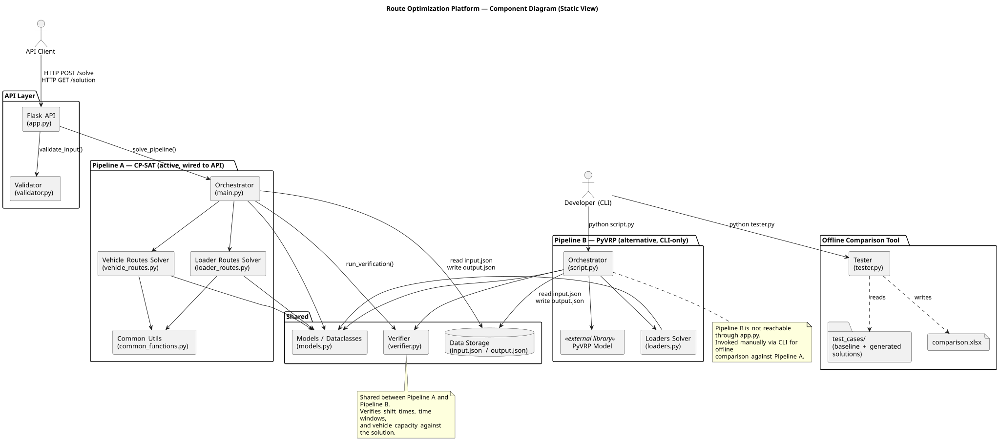
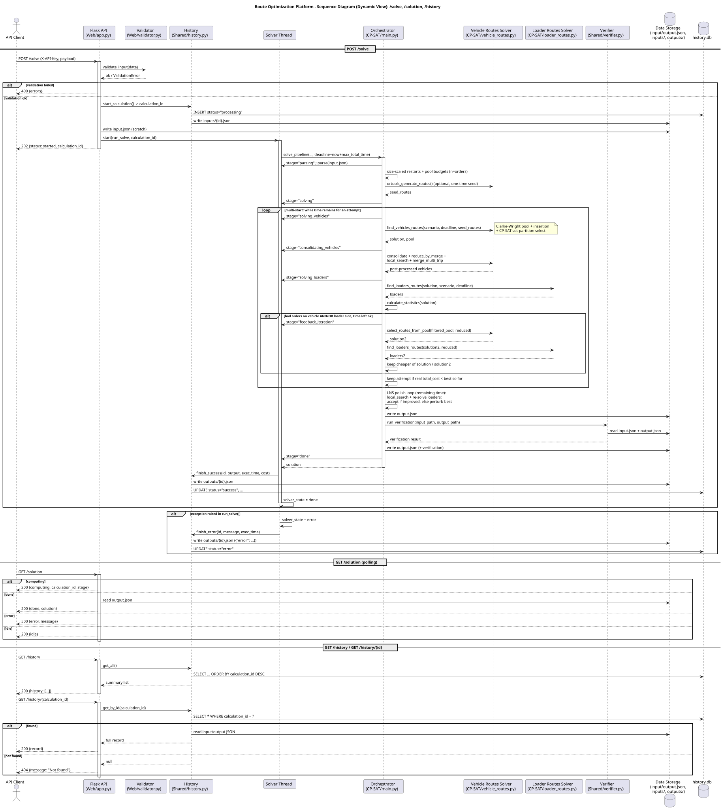
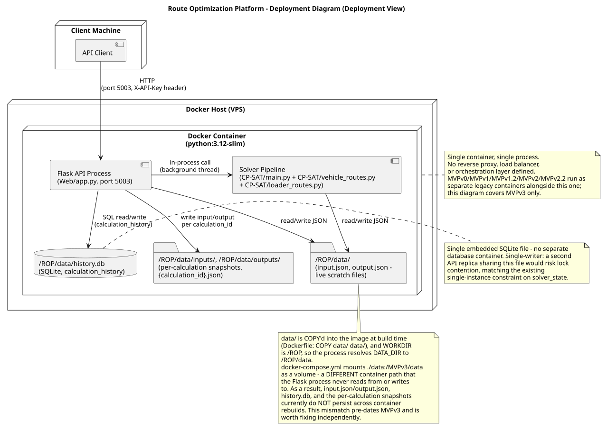

# Architecture

This document is the canonical index for the maintained architecture of the Route Optimization Platform. It covers three views — static, dynamic, and deployment — and links the Architecture Decision Records (ADRs) that justify key structural choices.

Two solver pipelines coexist in this system:
- **Pipeline A (CP-SAT)** — `main.py`, `vehicle_routes.py`, `loader_routes.py`. Wired to the Flask API. Active in production.
- **Pipeline B (PyVRP)** — `script.py`, `loaders.py`. Invoked manually via CLI. Not reachable through the API.

`verifier.py` is shared between both pipelines — each calls `run_verification()` after producing a solution.

Diagram sources and rendered views live in [static-view/](static-view/), [dynamic-view/](dynamic-view/), and [deployment-view/](deployment-view/).

## Static View

Source: [component-diagram.puml](static-view/component-diagram.puml)

**What the diagram shows:** the system's internal components grouped by responsibility (API layer, Pipeline A, Pipeline B, shared models/verifier/storage, offline comparison tool), external dependencies (PyVRP library), and the two actors that trigger work (API Client via HTTP, Developer via CLI).

**Coupling and cohesion:** Pipeline A and Pipeline B are structurally decoupled for route generation — no shared solver code, only shared data structures (`models.py`) and the JSON file storage. Each pipeline is internally cohesive: `vehicle_routes.py`/`loader_routes.py` share `common_functions.py`, `script.py`/`loaders.py` form a tight unit. `common_functions.py` and `models.py` are the only cross-cutting dependencies for route generation.

**Maintainability implications:** route-generation logic is duplicated across the two pipelines — a change to a routing constraint must be implemented twice if both pipelines are to stay consistent. This is accepted because the pipelines serve different purposes (A: production, B: offline baseline comparison) rather than being redundant implementations of the same contract. `verifier.py` is shared between both pipelines rather than being duplicated logic — Pipeline A and Pipeline B both call `run_verification()` after producing a solution, reducing the maintainability cost for verification logic specifically. The Validator-before-Orchestrator structure in the API layer keeps invalid input from reaching solver code, limiting the blast radius of malformed requests.

**Related decisions:** the dual-pipeline structure and its maintainability tradeoffs are formalized in [ADR-001](adr/ADR-001-dual-solver-pipelines.md); the shared Verifier component is formalized in [ADR-003](adr/ADR-003-shared-verifier.md).

**Quality requirements supported/constrained:** the Validator-before-Orchestrator structure directly supports [QR-002](../quality-requirements.md#qr-002-route-data-confidentiality) by rejecting invalid/malicious input before it is persisted or processed. The absence of a shared solver abstraction constrains QR-003 (testability) — coverage effort is duplicated across two independent route-generation code paths, though verification logic is now tested once via the shared Verifier component.

## Dynamic View

Source: [sequence-diagram.puml](dynamic-view/sequence-diagram.puml)

**Scenario:** a client submits a routing problem (`POST /solve`), the API validates and acknowledges immediately, solving runs asynchronously in a background thread, and the client polls (`GET /solution`) until the result is ready.

**Why this scenario matters:** it is the only path by which the product delivers value to a customer. It also encodes the API's core non-functional contract — the client is never blocked on solver runtime, which can range from seconds to minutes.

**What it helps reason about:** the integration boundary between the stateless HTTP layer and the stateful in-process solver thread (`solver_state`, protected by `solver_lock`); the failure surface (validation errors returned synchronously, solver errors surfaced only on the next poll); and the async design's direct link to [QR-001](../quality-requirements.md#qr-001-api-responsiveness) — HTTP response time is decoupled from solver completion time.

**Related decisions:** the asynchronous `/solve` design shown in this diagram is formalized in [ADR-002](adr/ADR-002-async-solve-with-polling.md); the verification step is formalized in [ADR-003](adr/ADR-003-shared-verifier.md).

**What the diagram shows:** message flow from `POST /solve` through validation, thread spawn, and pipeline execution (vehicle routes → loader routes → statistics → persisted output → verification against the same solution before final persistence), followed by the separate polling exchange on `GET /solution` with its three possible states (computing, done, error).

## Deployment View

Source: [deployment-diagram.puml](deployment-view/deployment-diagram.puml)

**What the diagram shows:** a single Docker container (`python:3.12-slim`) running the Flask API process on port 5002, with the solver pipeline executing in-process (background thread, not a separate service), and a `data/` directory holding `input.json`/`output.json`.

**Why this deployment model was chosen:** the workload is single-tenant and low-concurrency (one dispatcher, sequential solves via the `solver_lock` guard), so a single-process, single-container deployment avoids the operational cost of a multi-service architecture without sacrificing the current use case.

**How it supports/constrains the product:** it supports fast, simple deployment (`docker build` + `docker run`). It constrains horizontal scaling — `solver_state` is in-process memory, so a second replica would not share solve status with the first, and the `409 Already solving` guard only protects a single instance.

**Operational considerations:** `data/` is `COPY`'d into the image at build time, not mounted as a volume — `output.json` writes do not persist across container rebuilds unless a volume is added. There is no reverse proxy or TLS termination in front of the Flask process; `X-API-Key` is currently the only access control, transmitted over whatever transport fronts port 5002.

## Architecture Decision Records

See [docs/architecture/adr/](adr/) for the full ADR set.

| ADR | Decision | Related QR |
|---|---|---|---|
| [ADR-001](adr/ADR-001-dual-solver-pipelines.md) | Maintain two independent solver pipelines (CP-SAT and PyVRP) instead of a shared abstraction | QR-003 |
| [ADR-002](adr/ADR-002-async-solve-with-polling.md) | Run `/solve` asynchronously via background thread with `/solution` polling instead of a synchronous request | QR-001, QR-004 |
| [ADR-003](adr/ADR-003-shared-verifier.md) | Share `verifier.py` between both pipelines instead of duplicating or omitting verification for Pipeline A | QR-003 |
| [ADR-004](adr/ADR-004-api-key-authentication.md) | Enforce access control via a shared API key checked at every protected endpoint | QR-002 |
| [ADR-005](adr/ADR-005-solver-time-limits.md) | Configure CP-SAT `max_time_in_seconds` to bound solver runtime | QR-004 |
| [ADR-006](adr/ADR-006-hosted-documentation.md) | Publish maintained documentation via GitHub Pages from `docs/` | QR-005 |