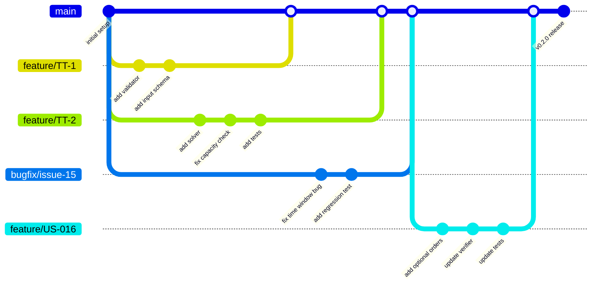

# Development Process

## Table of Contents

- [Development Process](#development-process)
  - [Table of Contents](#table-of-contents)
  - [Overview](#overview)
  - [Work Management Boards](#work-management-boards)
    - [Product Backlog View](#product-backlog-view)
    - [Sprint Backlog View](#sprint-backlog-view)
    - [Board Configuration](#board-configuration)
  - [Workflow States](#workflow-states)
  - [Git and Review Workflow](#git-and-review-workflow)
    - [Git Branching Strategy](#git-branching-strategy)
    - [GitGraph Diagram](#gitgraph-diagram)
    - [Explanation of the GitGraph Diagram](#explanation-of-the-gitgraph-diagram)
    - [Detailed Workflow steps](#detailed-workflow-steps)
  - [Configuration \& Secrets Management](#configuration--secrets-management)
  - [Reproducible Development Environment](#reproducible-development-environment)
  - [CI \& Deployment Automation](#ci--deployment-automation)
  - [Definition of Done](#definition-of-done)

---

## Overview

**Project**: Route Optimization Platform

**Technology Stack**: Python + Flask + Flask.CORS + PyVRP + CP-SAT + Docker + Docker Compose

**Platform**: GitHub 

**Key Process Characteristics**:

- one-week Sprints
- feature-branch workflow with PR reviews
- CI/CD with automated testing

---

## Work Management Boards

### Product Backlog View

The Product Backlog is the single ordered source of all product work for the team. It is maintained using:

| Aspect | Description |
|--------|-------------|
| **Tool** | GitHub Projects |
| **Link** | [Product Backlog URL](https://github.com/orgs/iu-students/projects/1/views/2) |
| **Ordering** | The backlog is ordered by priority (highest priority items at the top) |
| **Refinement** | Backlog refinement is an ongoing activity; items are clarified and estimated as they move up.  |

The Product Backlog contains:

- User stories
- Other PBIs (Technical work, Bug reports, etc.)

The Product Backlog view shows:

- Assignees
- Status
- Linked pull request
- Story points
- MoSCoW priority
- Labels (Active/Removed, priority, work status)
- release
- MVP version

### Sprint Backlog View

The Sprint Backlog represents the work selected for the current Sprint. It is implemented using the milestone/issue functionality:

| Aspect | Description |
|--------|-------------|
| **Tool** | GitHub Milestones |
| **Current Sprint** | Sprint 3 |
| **Link** | [Sprint 3 Backlog URL](https://github.com/orgs/iu-students/projects/1/views/6) |
| **Contents** | US-006, US-016, TT-1, TT-2, TT-3, TT-4, TT-5 |

The Sprint Backlog view shows:

- Assignees
- Status
- Linked pull request
- Story points
- MoSCoW priority
- Labels (Active/Removed, priority, work status)
- release
- MVP version
- milestone


### Board Configuration

**Board columns**:
| Work status | Purpose |
|---------------|---------|
| To Do | Items not yet started |
| Ready | Items ready to be picked up |
| In Progress | Work currently being done |
| Review | Ready for review |
| Done | Completed work |

---

## Workflow States

| Status | Meaning | Entry Criteria | Exit Criteria |
|--------|---------|----------------|---------------|
| **To Do** | PBI exists but not ready to start | Has description, priority, basic acceptance criteria | Refined and moved to Ready |
| **Ready** | Sprint-ready and can be started | Assigned to Sprint, estimated, has clear AC, implementer and reviewer named | Work starts → In Progress |
| **In Progress** | Work is actively being developed | Branch created, local development started | PR/MR opened → Review |
| **Review** | Implementation complete and ready for review | PR/MR open, all CI checks pass, reviewer assigned | Reviewer approves, PR/MR merged → Done |
| **Done** | Work complete, Definition of Done satisfied | AC met, DoD satisfied, PR/MR merged | Issue closed |

---

## Git and Review Workflow

### Git Branching Strategy

The team uses a **feature-branch workflow** with protected default branch. The following diagram illustrates the branching and merging process:

### GitGraph Diagram



### Explanation of the GitGraph Diagram

The diagram shows the team's typical development workflow:

1. **Main Branch**: `main` is the protected default branch. It always contains production-ready code. Direct pushes are disabled.

2. **Feature Branches**: Each feature, bug fix, or task gets its own branch from `main`:
   - Pattern: `<issue-number>-short-description`
   - Example: `54-course-task-documentation-week-4`

3. **Merging Process**:
   - Feature branches are merged into `main` via PR/MR after review

### Detailed Workflow steps

- **Issue creation**:  
  - Every change must have a corresponding issue.  
  - Issue templates are used for consistency (User Story, PBIs, Bug Reports, Course Tasks).
- **Branch creation**:  
  - Format: `<issue-number>-short-description`
  - Example: `54-course-task-documentation-week-4`
- **Development**:
  - Work on the branch with regular, descriptive commits
  - Run tests locally to ensure nothing is broken
  - Keep commits focused and atomic
- **PR/MR process**:  
  - Open PR against `main`  
  - Use PR templates for consistency
  - Title must reference issue: `[#123] Description`  
  - At least **1 approval** from a different team member  
  - All required CI checks must pass
- **Review**:  
  - Reviewer checks from PR template
  - Address feedback via fixup commits
- **Issue resolution**:  
  - Issue is automatically closed when PR is merged (if linked)  
  - Issues can be reopened if some extra work arise
- **Merge**
  - After approval and passing CI, the PR is merged
  - Merge commits are preserved
  - The related issue is marked Done and closed
- **Release**
  - When enough work is complete, a release is created
  - Write release notes in CHANGELOG.md
  - Create the release on GitHub
  
---

## Configuration & Secrets Management

The platform requires minimal secret configuration. Secrets are handled as follows:

| Aspect | Approach |
|--------|----------|
| **Secret storage** | Secrets are stored in a `.env` file that is never committed to the repository. The `.env` file is listed in `.gitignore`. |
| **Sanitized example** | `.env.example` is committed and contains placeholder values as a reference for required variables. |
| **Runtime configuration** | Docker Compose passes the `.env` file to containers via the `env_file` directive.|
| **Required variables** | `API_KEY` — master authentication key for all API requests; `FLASK_HOST` — binding address; `FLASK_DEBUG` — debug mode toggle. |
| **CI secrets** | No CI secrets are currently required.|
| **Ignored files** | `.env`, `__pycache__/`, `*.pyc`, `.coverage`, `.pytest_cache/`, data files (`input.json`, `output.json`), and build artifacts are kept out of version control via `.gitignore`. |
| **Generated files** | No generated files are committed. |

The `.env.example` file content:

```
API_KEY=your_secret_key_here
FLASK_HOST=127.0.0.1
FLASK_DEBUG=false
```

---

## Reproducible Development Environment

The platform uses **Docker Compose** as the primary reproducible development and deployment environment.

| Aspect | Description |
|--------|-------------|
| **Container runtime** | Docker Compose with four service definitions (`mvpv0`, `mvpv1`, `mvpv1.2`, `mvpv2`), each exposing a different port (5000, 5001, 5011, 5002). |
| **Base image** | `python:3.12-slim` for all MVP versions. |
| **Dependency management** | Each MVP version has its own `requirements.txt`. Dependencies are installed during the Docker build. |
| **Local setup steps** | `cp .env.example .env`, then `docker compose up --build -d` |
| **Environment parity** | The same Dockerfile and Compose configuration are used in development, CI, and production, ensuring environment consistency. |
| **Alternative setup** | Developers may also run a specific Flask app directly with Python 3.12 after installing its dependencies via `pip install -r api/MVPv1.2/requirements.txt`. |
| **Test instances** | Test input/output data is stored in `instances/` (i1.json–i10.json) and `data/`. |

CI runs on `ubuntu-latest` GitHub Actions runners with Python 3.12. No Nix shell or `devenv` configuration is used; the project relies on Docker and pip-based dependency management.

---

## CI & Deployment Automation

### CI Pipeline

The repository uses **GitHub Actions** with four workflow files. All workflows run on pull requests and on pushes to the `main` branch:

| Workflow | Jobs | Purpose |
|----------|------|---------|
| `ci-file-checks.yml` | Linting (`flake8`), Security audit (`bandit`) | Enforce code style and catch security issues. |
| `ci-tests.yml` | Unit & integration (MVPv1), Unit & integration (MVPv2), Coverage report | Run logic tests for both pipeline versions and report line coverage with `pytest-cov`. MVPv2 job sets `TEST_TARGET=v2`. |
| `ci-qrt.yml` | API responsiveness, confidentiality, coverage & docs availability | Run automated QRTs (QRT-001, QRT-002, QRT-003, QRT-005). |
| `ci-link-check.yml` | Markdown link checking (`lychee`) | Check all repository Markdown files and `reports/` for broken links. |

### CI Checks Summary

| Check | Tool/Command | Required for merge |
|-------|-------------|-------------------|
| Linting | `flake8 api/` | Yes |
| Security audit | `bandit -r api/ -ll` | Yes |
| Unit & integration tests (MVPv1) | `pytest tests/` (excluding QRTs) | Yes |
| Unit & integration tests (MVPv2) | `pytest tests/` with `TEST_TARGET=v2` (excluding selected v1-only tests) | Yes |
| Coverage | `pytest-cov` with ≥30% per critical module | Yes |
| QRTs | `pytest tests/test_qrt_001_api_responsiveness.py tests/test_qrt_002_api_confidentiality.py tests/test_qrt_003_critical_module_coverage.py tests/test_qrt_005_docs_availability.py -v` | Yes |
| Solver timing check (QRT-004) | Run manually or with extended timeout: `pytest tests/test_qrt_004_solver_completion_time.py -v --timeout=950` | Yes |
| Link check | `lychee` on all `*.md` files | Yes |

### Quality Requirement Tests

The CI pipeline verifies five quality requirement tests:

| QRT | Quality Requirement | What it verifies |
|-----|-------------------|------------------|
| QRT-001 | QR-001 (API responsiveness) | Each endpoint returns HTTP response within 2 seconds. |
| QRT-002 | QR-002 (Confidentiality) | Unauthenticated requests get HTTP 401; no data leaked. |
| QRT-003 | QR-003 (Critical module testability) | Every critical module has ≥30% line coverage. |
| QRT-004 | QR-004 (Solver completion time) | CP-SAT solver completes within 900 seconds. |
| QRT-005 | QR-005 (Hosted documentation availability) | Docs site returns HTTP 200 within 10 seconds. |

QRT-001, QRT-002, QRT-003, and QRT-005 run in CI on every PR and push to `main`. QRT-004 (solver completion time) is a longer-running test that may require a separate CI trigger or manual execution.

### Additional QA Check

The additional QA check (required by Repository Requirements, distinct from linting, tests, and link checking) is the **Bandit security audit** (`bandit -r api/ -ll`). It scans the Python source code for common security issues such as hardcoded passwords, injection vulnerabilities, and unsafe function usage.

### Deployment Automation

| Aspect | Description |
|--------|-------------|
| **Deployment model** | Manual deployment via Docker Compose on a remote server. |
| **Server** | Deployed at `http://139.100.207.201` with four parallel services (MVPv0 on 5000, MVPv1 on 5001, MVPv1.2 on 5011, MVPv2 on 5002). |
| **Process** | A team member pulls the latest `main` branch on the server, rebuilds the relevant service with `docker compose build <service>`, and restarts it with `docker compose up -d`. |
| **Continuous delivery** | No automated CD pipeline is configured. Deployment is triggered manually after a SemVer release is created. |

### Release Process

1. When Sprint work is complete on `main`, the team creates a SemVer release with a `v`-prefixed tag (e.g., `v0.2.0`).
2. The release description links to:
   - The mapped course MVP milestone
   - The Sprint milestone
   - Current access/running instructions
   - The public sanitized demo video
   - The weekly public report
3. `CHANGELOG.md` entries in `[Unreleased]` are moved into a new dated section matching the release version.

---

## Definition of Done

The team's Definition of Done is maintained in [`docs/definition-of-done.md`](definition-of-done.md). It requires, at minimum:

- All issue acceptance criteria are satisfied.
- The work is reviewed and approved by at least one other team member.
- For user stories, linked supporting PBIs provide implementation, review, and verification evidence.
- Required tests and CI checks pass (linting, tests, coverage, QRTs, link check, additional QA check).
- Relevant quality requirements and quality requirement tests are satisfied or documented as not applicable.
- Relevant architecture documentation is satisfied or documented as not applicable (Assignment 5+).
- CI quality gates pass before merge.
- Verification evidence is preserved in normal workflow artifacts.
- `CHANGELOG.md` is updated for user-visible changes or explicitly marked as not applicable.
- For supporting/implementation PBIs, the issue-linked PR/MR is merged into `main`.
