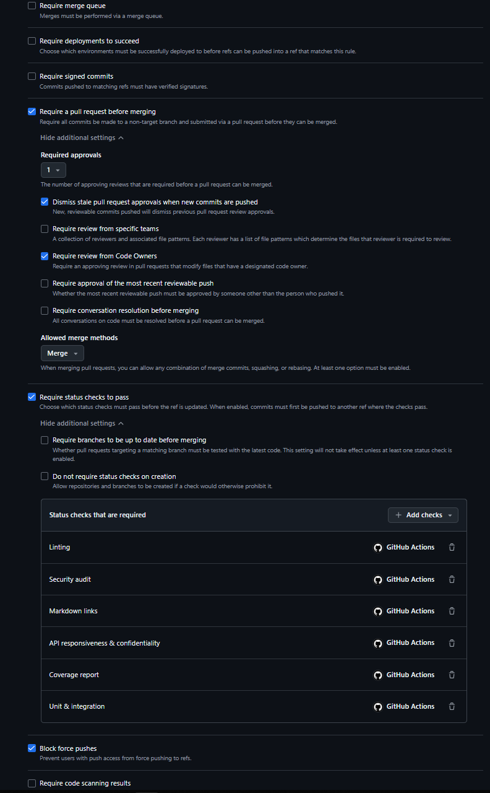

# Testing

## Testing Strategy

The active product version is **MVPv3** (`api/MVPv3/`), which uses a single **CP-SAT solver pipeline**:

- **CP-SAT pipeline** (`CP-SAT/main.py` + `CP-SAT/vehicle_routes.py` + `CP-SAT/loader_routes.py`). `main.py` runs a two-step pipeline. First it generates a pool of feasible vehicle routes using Clarke-Wright and insertion heuristics. Then a CP-SAT set-partitioning model picks the best subset of routes. The same idea is used for the loaders: chains of loader slots are built with an insertion heuristic, and a second CP-SAT model picks the best chains. The solver supports multi-start, inter-route order exchange, dual-mode optional-order skipping, and full time-budget utilisation.

Shared modules across the `api/MVPv3` tree:

- `Web/validator.py` — validates `input.json` before any solver runs.
- `Shared/verifier.py` — checks the solution (capacity, time windows, shift) on `output.json`.
- `tester.py` — calculates the total cost of a solution and compares it with the baseline. It also writes an Excel report (`comparison.xlsx`).
- `Shared/models.py` — data classes used by the pipeline.
- `Web/app.py` — Flask REST API exposing `/solve`, `/solution`, `/history`, `/validate`, `/metrics`, and `/health`.
- `Shared/history.py` — SQLite persistence for calculation history (`GET /history`, `GET /history/{id}`).
- `CP-SAT/common_functions.py` — shared distance helper used by the CP-SAT route generators.

We focus our testing on the following areas, because a bug in any of them breaks the result or the baseline comparison:

- **Input validity:** `Web/validator.py` must reject broken input before any solver runs.
- **Feasibility:** every route must respect capacity, time windows and the shift limit. `Shared/verifier.py` checks this for every solution.
- **Correct data:** arrival times and the loader task list must be calculated correctly, because the loader step and the verifier use them.
- **Cost calculation:** `tester.py` must compute the total cost correctly, so the comparison with the baseline is trustworthy.
- **API contract:** `Web/app.py` must respond to `/health` and `/solve` under 2s and reject requests without a valid API key (QRT-001, QRT-002).
- **Critical module testability:** each critical module must have at least 30% automated line coverage (QRT-003, QR-003).
- **Solver completion time:** the CP-SAT solver must complete within 15 minutes on a realistic test instance (QRT-004, QR-004).
- **Docs availability:** the hosted documentation site must be reachable and serve the entry page (QRT-005, QR-005).
- **Solver optimality:** the solver must beat the baseline `total_cost` (computed by `tester.calc_cost()`) on at least 7 out of 10 standard test instances (QRT-006, QR-006). Current state: **10/10** beat baseline.

The legacy **PyVRP pipeline** (`api/MVPv2.2/PyVRP/`) is retained in the repository for reference but is **not part of MVPv3**. Its unit tests (`test_script.py`, `test_loaders.py`) and integration tests (`test_integration.py`) are explicitly excluded from CI runs targeting MVPv3.

## Critical Modules and Coverage

| Critical module | Path in `api/MVPv3/` | Why critical | Required line coverage | Current line coverage | Evidence |
|---|---|---|---|---|---|
| `main.py` | `CP-SAT/main.py` | Two-step pipeline orchestration: route pool generation (Clarke-Wright and insertion), CP-SAT set partitioning for vehicles and loaders, multi-start, inter-route exchange, feedback loop. | 30% | ≥30% | [Coverage run](https://github.com/iu-students/route-optimization-platform/actions/runs/29644953462) |
| `verifier.py` | `Shared/verifier.py` | Feasibility check (capacity, time windows, shift). Guards the correctness of every solution. | 30% | ≥30% | [Coverage run](https://github.com/iu-students/route-optimization-platform/actions/runs/29644953462) |
| `validator.py` | `Web/validator.py` | Input schema and value validation. Stops the solver from running on broken input. | 30% | ≥30% | [Coverage run](https://github.com/iu-students/route-optimization-platform/actions/runs/29644953462) |
| `app.py` | `Web/app.py` | REST API entrypoint (Flask) exposing `/solve`, `/solution`, `/history`, `/validate`, `/metrics`, and `/health`. | 30% | ≥30% | [Coverage run](https://github.com/iu-students/route-optimization-platform/actions/runs/29644953462) |
| `tester.py` | `tester.py` | Calculates the total cost of a solution and exports the baseline comparison report. | 30% | ≥30% | [Coverage run](https://github.com/iu-students/route-optimization-platform/actions/runs/29644953462) |
| `history.py` | `Shared/history.py` | SQLite persistence for calculation history. Powers `GET /history` and `GET /history/{id}`. | 30% | ≥30% | [Coverage run](https://github.com/iu-students/route-optimization-platform/actions/runs/29644953462) |
| `common_functions.py` | `CP-SAT/common_functions.py` | Shared distance helper used by all route generators. | 30% | ≥30% | [Coverage run](https://github.com/iu-students/route-optimization-platform/actions/runs/29644953462) |

**Global repository coverage:** ≥85% (source limited to `api/MVPv3` per `coveragerc`)

**Note:** Coverage is measured on the `api/MVPv3` source tree via `pytest --cov-config=coveragerc --cov`. The `coveragerc` config sets `source = api/MVPv3`. The critical modules listed above are checked by QRT-003 (see [docs/quality-requirement-tests.md](quality-requirement-tests.md#qrt-003-critical-module-coverage)).

## Automated Test Status

| Test type | Scope | Command or CI check | Latest result | Evidence |
|---|---|---|---|---|
| Unit tests | `verifier.py` (shift, time window, capacity checks; route segmentation) | `pytest tests/test_verifier.py` | Passing | [CI run](https://github.com/iu-students/route-optimization-platform/actions/runs/29644953462/job/88081540474) |
| Unit tests | `validator.py` (schema, value ranges, time window order, duplicate ids, invalid JSON) | `pytest tests/test_validator.py` | Passing | [CI run](https://github.com/iu-students/route-optimization-platform/actions/runs/29644953462/job/88081540474) |
| Unit tests | `tester.py` (Euclidean distance, coord lookup, cost components, optional penalty, missing required orders, Excel export) | `pytest tests/test_tester.py` | Passing | [CI run](https://github.com/iu-students/route-optimization-platform/actions/runs/29644953462/job/88081540474) |
| Unit tests | CP-SAT modules: `vehicle_routes.py`, `loader_routes.py`, `main.py` (Clarke-Wright, insertion, slot building, chain eval, solve_with_feedback, statistics, optional order logic) | `pytest tests/test_main.py` | 30+ passed | [CI run](https://github.com/iu-students/route-optimization-platform/actions/runs/29644953462/job/88081540474) |
| Integration tests (CP-SAT) | Full `main.py` pipeline on a small instance (5 orders, reduced restarts), checked by `verifier.py` | `pytest tests/test_integration_cpsat.py` | Passing | [CI run](https://github.com/iu-students/route-optimization-platform/actions/runs/29644953462/job/88081540474) |
| Automated QRTs (CI) | QR-001 (responsiveness), QR-002 (confidentiality), QR-003 (coverage), QR-005 (docs availability) | `pytest tests/test_qrt_001_api_responsiveness.py tests/test_qrt_002_api_confidentiality.py tests/test_qrt_003_critical_module_coverage.py tests/test_qrt_005_docs_availability.py` | 4 QRT suites | [CI run](https://github.com/iu-students/route-optimization-platform/actions/runs/29644953471/job/88081540482) |
| Automated QRT (manual) | QR-004 (solver timing) — runs outside CI due to solver runtime | `pytest tests/test_qrt_004_solver_completion_time.py -v --timeout=950` | N/A | N/A |
| Automated QRT (manual) | QR-006 (solver optimality against baseline via `tester.calc_cost()`) | `pytest tests/test_qrt_006_solver_optimality.py -v` (not in CI) | 10/10 | N/A |
| Linting & formatting (`flake8`) | PEP8 style, syntax, spacing, line length | `flake8 api/` | Passing | [CI run](https://github.com/iu-students/route-optimization-platform/actions/runs/29644953449/job/88081540391) |
| Additional QA check (`bandit`) | Static analysis for security issues | `bandit -r api/ -ll` | Passing | [CI run](https://github.com/iu-students/route-optimization-platform/actions/runs/29644953449/job/88081540386) |
| Link checking | All Markdown files (`lychee`) | `lychee --cache --verbose --no-progress --exclude "http://139.100.207.201:5000" './**/*.md' './reports/**/*.md'` (via `lycheeverse/lychee-action@v2` in CI) | Passing | [CI run](https://github.com/iu-students/route-optimization-platform/actions/runs/29644953464/job/88081540529) |

**Note on PyVRP tests:** The PyVRP pipeline (`api/MVPv2.2/PyVRP/`) is retained for reference. Its tests (`test_script.py`, `test_loaders.py`, `test_integration.py`) are **explicitly excluded** from CI workflows targeting MVPv3. They remain in the repository for teams maintaining the v2.2 codebase but are not required for MVPv3 validation.

## CI and QA Check Status

| Gate or check | Required for Done? | Latest protected-branch status | Evidence |
|---|---|---|---|---|
| Linting & formatting (`flake8`) | Yes | Passing | [CI run](https://github.com/iu-students/route-optimization-platform/actions/runs/29644953449/job/88081540391) |
| Unit tests (shared modules + CP-SAT) | Yes | Passing | [CI run](https://github.com/iu-students/route-optimization-platform/actions/runs/29644953462/job/88081540474) |
| Integration tests (CP-SAT) | Yes | Passing | [CI run](https://github.com/iu-students/route-optimization-platform/actions/runs/29644953462/job/88081540474) |
| Line coverage (≥30% per critical module) | Yes | Passing | [CI run](https://github.com/iu-students/route-optimization-platform/actions/runs/29644953462) |
| Additional QA check (`bandit` security audit) | Yes | Passing | [CI run](https://github.com/iu-students/route-optimization-platform/actions/runs/29644953449/job/88081540386) |
| Automated QRTs (QRT-001, QRT-002, QRT-003, QRT-005) | Yes | Passing | [CI run](https://github.com/iu-students/route-optimization-platform/actions/runs/29644953471/job/88081540482) |
| Link checking (`lychee`) | Yes | Passing | [CI run](https://github.com/iu-students/route-optimization-platform/actions/runs/29644953464/job/88081540529) |

## Additional QA Check Rationale

| QA objective or risk | Additional QA check | Scope | Latest result | Evidence | Limitations or follow-up |
|---|---|---|---|---|---|
| Common security issues in Python code (hardcoded credentials, SQL injection, shell injection, unsafe imports) | `bandit` static analysis | All `api/` source code | Passing | [CI run](https://github.com/iu-students/route-optimization-platform/actions/runs/29644953449/job/88081540386) | Uses `-ll` (low-confidence skip); may miss some patterns. Covers source-code risks, not dependency CVEs. |

`bandit` runs as the additional automated QA check in `ci-file-checks.yml`. It satisfies the requirement for an extra automated check beyond linting, formatting, tests, coverage, QRTs, and link checking. As a static-analysis security tool, it is distinct from the `flake8` linting + formatting job and the `pytest` test jobs.

## Manual Evidence

| Evidence | Scope | Result | Follow-up PBI or issue |
|---|---|---|---|
| Manual run of `Shared/verifier.py` on full `input.json` (113 orders) | Feasibility of the full solution | ALL CHECKS PASSED | — |
| Manual run of `tester.py` on `i1`–`i10` comparing solver output against baseline | Cost comparison, Excel report `comparison.xlsx` | Solver beats baseline on **10/10** instances | — |

## CI and Branch Protection

- **CI pipeline:** [CI workflows](https://github.com/iu-students/route-optimization-platform/actions)
- **Latest protected-default-branch run:** [Tests & coverage](https://github.com/iu-students/route-optimization-platform/actions/runs/29644953462/job/88081540474)
- **Branch protection / rules evidence:** 

## Continuation of Quality Gates

- Unit and integration tests for the CP-SAT pipeline must keep passing on every merge to `main`.
- Line coverage for critical modules (under `api/MVPv3/`) must stay above 30%.
- QRT-001, QRT-002, QRT-003, QRT-005 run in CI on every PR and push to `main`.
- QRT-004 (solver completion time) runs outside CI. Execute manually:
  `pytest tests/test_qrt_004_solver_completion_time.py -v --timeout=950`.
- QRT-006 (solver optimality against baseline) runs outside CI. Execute manually:
  `pytest tests/test_qrt_006_solver_optimality.py -v`.
  Both baseline scores and solver output are compared using `tester.calc_cost()`.
  Current state: **10/10** test cases beat the baseline.
- Linting & formatting (`flake8`) must pass on every merge to `main`.
- Additional QA check (`bandit` static analysis) must pass on every merge to `main`.
- Link checking (`lychee`) must pass on every merge to `main`.
- If any gate is replaced, the replacement must be documented and provide equal or stronger coverage.
- PyVRP-related tests (`test_script.py`, `test_loaders.py`, `test_integration.py`) are excluded from MVPv3 CI. They are retained in the repository for reference only.
