### 1. Project name, short description, and link to the root LICENSE
**Project Name:** Route Optimization Platform  
**Short Description:** An API service for optimizing delivery logistics, integrating vehicle routing (PyVRP) with greedy loader distribution algorithms to minimize idle time and maximize shift efficiency.

**License:** [MIT License](../../LICENSE)

### 2. Summary of the current user-story and PBI scope since Assignment 2

Since Assignment 2, the Product Backlog has migrated from a static markdown document into a fully tracked GitHub Issues backlog. The user-story and PBI scope has evolved with the following changes:

*   **Revised Formulations & Replacements:** Several user stories were rewritten to align with the target roles defined by the customer. US-01 (Display map) was replaced with **US-11** (Receiving a pre-planned route), US-05 (Optimal routing for driver) was replaced with **US-12** (Optimal routing for manager), and US-09 (Account for loaders' schedules) was replaced with **US-13** (Respecting shift schedules for drivers/loaders). The original stories were marked as `Removed` to preserve traceability.

    *   **Relevant Issues for current state:**
        *   [Issue #32 - US-11: Receiving a pre-planned route](https://github.com/iu-students/route-optimization-platform/issues/32) 
        *   [Issue #33 - US-12: Optimal routing for resource savings](https://github.com/iu-students/route-optimization-platform/issues/33) 
        *   [Issue #30 - US-13: Respecting shift schedules to finish on time](https://github.com/iu-students/route-optimization-platform/issues/30) 
        

*   **Newly Added Stories:** **US-14** (Respecting order delivery time windows) was added as a `Must Have` to ensure route feasibility and customer satisfaction. Additionally, following the Week 3 Sprint Review, new `Could Have`/`Should Have` stories will be added to the backlog for handling optional/mandatory orders and displaying calculation metrics for the manager next week.
    *   **Relevant Issues for current state:**
        *   [Issue #27 - US-14: Respecting order delivery time windows](https://github.com/iu-students/route-optimization-platform/issues/27) 

*   **PBI Decomposition:** The active `Must Have` user stories selected for MVP v1 were decomposed into smaller, estimable supporting Technical PBIs (e.g., TT-1, TT-5) to allow parallel execution during the Sprint.
*   **MVP v1 Scope Finalization:** The initial proposed scope was officially locked in for Sprint execution, focusing on delivering fixed, feasible routes.

### 3. Report on which customer feedback points from Assignment 2 were addressed in MVP v1
During Assignment 2, the customer provided specific feedback regarding roles, constraints, and architectural approaches. The following points were directly addressed and implemented in the MVP v1 scope:
1.  **Role Alignment for Route Planning:** The customer emphasized that drivers and loaders want to reduce responsibility and adhere to shift durations, rather than optimizing company resources. This was addressed in MVP v1 by implementing US-11 (providing fixed, pre-planned routes) and US-13 (respecting individual shift schedules).
2.  **Core Feasibility Constraints:** The customer highlighted that basic route feasibility must be maintained. MVP v1 addresses this by strictly enforcing US-10 (vehicle capacity constraints) and US-14 (order delivery time windows).
3.  **Basic Algorithmic Approach:** The customer suggested starting with a straightforward approach before attempting complex joint optimization. MVP v1 fulfills this by using `PyVRP` for vehicle routing and a `greedy algorithm` for loader distribution on top of those routes.
4.  **Interface Prototype:** The customer agreed that a full user UI was unnecessary for the MVP. This was addressed by delivering a `Swagger UI` prototype, allowing managers to interact with the API and send JSON requests directly.

### 4. Link to historical reports/week2/user-stories.md
*   [Historical Assignment 2 User Stories](../week2/user-stories.md)

### 5. Link to current docs/user-stories.md
*   [Current User Stories Index (`docs/user-stories.md`)](../../docs/user-stories.md)

### 6. Link to the Product Backlog view.
*   [Product Backlog](https://github.com/orgs/iu-students/projects/1/views/2)

### 7. Link to the current Sprint Backlog view.
*   [Current Sprint Backlog](https://github.com/orgs/iu-students/projects/1/views/3)

### 8. Link to the current Sprint milestone as the authoritative source for the Sprint Goal, Sprint dates, and current Sprint scope.

*   [Current Sprint milestone](https://github.com/iu-students/route-optimization-platform/milestone/1)

### 9. Total Product Backlog size in Story Points.
20 + 40 + 20 + 13 + 13 + 8 + 40 + 13 + 13  + 16 (tech tasks) = 196 Story Points 

### 10. Total current Sprint size in Story Points.
63 

### 11. Link to the MVP version field, filtered view, or equivalent grouped view showing the MVP v1 scope.
* [MVP v1](https://github.com/orgs/iu-students/projects/1/views/4)

### 12. Description of the selected MVP v1 scope

The MVP v1 scope delivers the core route optimization pipeline, transforming raw order data into feasible, pre-planned daily routes for both vehicles and loaders. It covers the following active `Must Have` user stories:

*   **US-10 (Account for vehicle capacity):** Ensures the algorithm respects vehicle capacity limits when distributing orders.
*   **US-11 (Receiving a pre-planned route):** Generates fixed, ready-to-use routes for drivers and loaders, eliminating the need for manual planning.
*   **US-13 (Respecting shift schedules):** Guarantees that generated routes do not exceed the working shift durations of drivers and loaders.
*   **US-14 (Respecting order delivery time windows):** Ensures deliveries are scheduled within the specified customer time windows.

To implement this business logic, the user stories were decomposed into the following key supporting Technical PBIs (Sprint scope):

*   **TT-1 (JSON Reading Mechanism):** Implemented a mechanism to parse the input JSON file containing vehicle, loader, and order data, mapping it into internal data structures (`Scenario`, `Order`, `Vehicle` models).
*   **Vehicle Routing (PyVRP):** Integrated the `PyVRP` library to calculate optimal and feasible vehicle routes based on capacity and time window constraints.
*   **Loader Distribution (Greedy Algorithm):** Developed a greedy algorithm that assigns loaders to the generated vehicle routes. It prioritizes the most urgent points (earliest vehicle arrival), minimizes vehicle idle time, and ensures loaders return home before their shift ends.
*   **TT-5 (Output JSON Generation):** Implemented a function that formats the calculated routes into output JSON files, containing chronologically sorted points of delivery and expected arrival times for each individual driver/loader.
*   **API & Deployment:** Exposed the pipeline via a `Swagger UI` API interface and deployed the MVP to a public IP address for testing and customer review.

### 13. Explanation of PBI types, statuses, priorities, Sprint milestone usage, MVP version tracking, and task-decomposition approach

Our team follows the shared definitions outlined in `Process_Requirements.md` for managing our Product Backlog and workflow. Below is how we apply these rules in our GitHub repository:

*   **PBI Types:** We track two main types of Product Backlog Items. *User Stories* (e.g., US-10, US-14) represent business requirements and are documented in `docs/user-stories.md`. *Supporting Technical PBIs* (e.g., TT-1, TT-5) represent implementation, infrastructure, or testing work. Course administration tasks are tracked separately and are not considered PBIs.
*   **Statuses:** We use the canonical Work Status values consistently across GitHub Issues: `To Do`, `Ready`, `In Progress`, `Review`, and `Done`. For requirement tracking, User Stories use the `Active` and `Removed` statuses. Removed stories are preserved with an explanation rather than being deleted.
*   **Priorities:** All PBIs are ordered using the MoSCoW method (`Must Have`, `Should Have`, `Could Have`, `Won't Have`). The Product Backlog is ordered so that `Must Have` items for the current MVP are considered first.
*   **Sprint Milestone Usage:** We use GitHub Milestones to represent the Sprint container. The current Sprint milestone is the authoritative source for the Sprint Goal, Sprint dates, and Sprint scope. Any issue assigned to this milestone is considered part of the Sprint Backlog. 
*   **MVP Version Tracking:** To separate Sprint execution from product releases, we track MVP versions independently. We use a custom `MVP version` field (and a grouped Project View) to mark issues included in `MVP v1`. This allows us to filter specifically for the MVP delivery scope without confusing it with the Sprint timeline.
*   **Task-Decomposition Approach:** Following the shared rules, we do not use User Story issues as containers for implementation subtasks. When a User Story requires technical work, we decompose it into separate, linked Supporting PBIs (e.g., TT-1). These supporting PBIs have their own descriptions, Acceptance Criteria, Story Point estimates, an Implementer, and a different Reviewer. A User Story is only marked `Done` when all its linked supporting PBIs are completed, merged, and verified according to our Definition of Done.

### 14. RoadMap Summary
*   **Current Sprint (Sprint 1):**
The primary focus is developing and deploying MVP v1 (release v0.1.0). The team is delivering the core routing pipeline (PyVRP + greedy loaders) covering all Must Have user stories (vehicle capacity, time windows, shift schedules, pre-planned routes) and exposing it via a Swagger UI API. 

*   **Next Sprint (Sprint 2):**  
The direction will shift towards modifying the MVP v1 increment and developing an alternative version of the algorithm to solve the routing problem. The expected outcome is to have this new algorithmic version deployed and working on the server, as well as closing the implementation parts of the newly added user stories (such as optional orders and manager metrics).

[docs/roadmap.md](../../docs/roadmap.md)

### 15. References to the verification evidence for the completed MVP v1 PBIs.

The following merged Pull Requests and deployment links serve as verification evidence that the MVP v1 scope has been successfully implemented, reviewed, and deployed:

*   **TECH-01 & TECH-05 (JSON Reading & Generation):** [PR #43 - Task 1, 5 completed](https://github.com/iu-students/route-optimization-platform/pull/43) — *Evidence: Code merged into `main`. Contains parsing logic for input JSON files and output route JSON generation.*
*   **TECH-02 (Truck capacity verification):** [PR #50 - Implement truck capacity verification](https://github.com/iu-students/route-optimization-platform/pull/50) — *Evidence: Code merged into `main`. Contains validation logic for vehicle capacity constraints.*
*   **TECH-03 (Shift duration verification):** [PR #48 - Implement shift duration verification](https://github.com/iu-students/route-optimization-platform/pull/48) — *Evidence: Code merged into `main`. Contains validation logic for employee shift schedules.*
*   **TECH-04 (Time window verification):** [PR #46 - Implement order time window verification](https://github.com/iu-students/route-optimization-platform/pull/46) — *Evidence: Code merged into `main`. Contains validation logic for order delivery time windows.*
*   **API-01 & DEVOPS-01 (API & Deployment):** [PR #51 - other pbi deployment webinterface](https://github.com/iu-students/route-optimization-platform/pull/51) — *Evidence: Code merged into `main`. Implements API endpoints and deployment configuration.*
*   **Live Verification (DEVOPS-01):** [http://139.100.207.201:5000/docs/](http://139.100.207.201:5000/docs/) — *Evidence: Live, accessible deployment of the MVP v1 increment via Swagger UI, capable of processing requests and returning calculated routes.*

### 16. Summary of the current product status
The product is currently at the MVP v1 stage, successfully deployed and accessible via a public API (Swagger UI). All planned Must Have user stories for this iteration (US-10, US-11, US-13, US-14) and their supporting technical tasks have been implemented, reviewed, and merged into the protected main branch.

### 17. Summary of the next step 
*   Backlog Refinement: Add newly discovered Could Have/Should Have user stories to the Product Backlog, including handling optional/mandatory orders and displaying calculation metrics for the manager.
*   Re-run baseline tests and collect exact percentage statistics.
*   Research order cost estimation to evaluate economic viability.
*   Explore CP Solver integration for the assignment problem.

### 18. A contribution traceability table mapping each team member to their issues, PRs/MRs, and review activity.
| Team Member | Implemented Issues | Created PRs/MRs | Reviewed PRs/MRs (Approvals & Comments) |
| :--- | :--- | :--- | :--- |
| **Maxim Potushinskii** | [#36 - TECH-02: Truck capacity verification](https://github.com/iu-students/route-optimization-platform/issues/36) [#37 - TECH-03: Shift duration verification](https://github.com/iu-students/route-optimization-platform/issues/37) [#38 - TECH-04: Time window verification](https://github.com/iu-students/route-optimization-platform/issues/38) [#41 - API-01: Add API endpoints](https://github.com/iu-students/route-optimization-platform/issues/41) [#40 - DEVOPS-01: Deploy MVP v1 to hosting](https://github.com/iu-students/route-optimization-platform/issues/40) [#32 - US-011: Receiving a pre-planned route](https://github.com/iu-students/route-optimization-platform/issues/32) [#31 - US-010: Account for vehicle capacity](https://github.com/iu-students/route-optimization-platform/issues/31) [#30 - US-013: Respecting shift schedules](https://github.com/iu-students/route-optimization-platform/issues/30) [#27 - US-014: Respecting order delivery time windows](https://github.com/iu-students/route-optimization-platform/issues/27)| [PR #43 - Task 1, 5 completed](https://github.com/iu-students/route-optimization-platform/pull/43) | [PR #51 - other pbi deployment webinterface](https://github.com/iu-students/route-optimization-platform/pull/51) |
| **Dania Galieva** | [#44 - [Course Task]: week3 documentation](https://github.com/iu-students/route-optimization-platform/issues/44) | [PR #51 - other pbi deployment webinterface](https://github.com/iu-students/route-optimization-platform/pull/51) | [PR #43 - Task 1, 5 completed](https://github.com/iu-students/route-optimization-platform/pull/43) |
| **Timur Iusupov** | [#35 - TECH-01: Implement JSON file reader](https://github.com/iu-students/route-optimization-platform/issues/35) [#39 - TECH-05: Implement JSON file generation](https://github.com/iu-students/route-optimization-platform/issues/39) [#31 - US-010: Account for vehicle capacity](https://github.com/iu-students/route-optimization-platform/issues/31) [#30 - US-013: Respecting shift schedules](https://github.com/iu-students/route-optimization-platform/issues/30) [#27 - US-014: Respecting order delivery time windows](https://github.com/iu-students/route-optimization-platform/issues/27)| [PR #50 - Implement truck capacity verification](https://github.com/iu-students/route-optimization-platform/pull/50) | [PR #46 - Implement order time window verification](https://github.com/iu-students/route-optimization-platform/pull/46)  |
| **Marsel Tukhvatullin** | [#35 - TECH-01: Implement JSON file reader](https://github.com/iu-students/route-optimization-platform/issues/35) [#39 - TECH-05: Implement JSON file generation](https://github.com/iu-students/route-optimization-platform/issues/39) [#31 - US-010: Account for vehicle capacity](https://github.com/iu-students/route-optimization-platform/issues/31) [#30 - US-013: Respecting shift schedules](https://github.com/iu-students/route-optimization-platform/issues/30) [#27 - US-014: Respecting order delivery time windows](https://github.com/iu-students/route-optimization-platform/issues/27)| [PR #48 - Implement shift duration verification](https://github.com/iu-students/route-optimization-platform/pull/48) | [PR #50 - Implement truck capacity verification](https://github.com/iu-students/route-optimization-platform/pull/50) |
| **Anastasiia Glinskaia** | [#44 - [Course Task]: week3 documentation](https://github.com/iu-students/route-optimization-platform/issues/44) | [PR #46 - Implement order time window verification](https://github.com/iu-students/route-optimization-platform/pull/46) | [PR #48 - Implement truck capacity verification](https://github.com/iu-students/route-optimization-platform/pull/48) |

### 19. Link to the SemVer release mapped to MVP v1 

[SemVer](https://github.com/iu-students/route-optimization-platform/releases/tag/v0.1.0)

### 20. Link to the root CHANGELOG.md
[Root CHANGELOG.md](../../CHANGELOG.md)

### 21. Link to Process_Requirements.md
[Process_Requirements.md](../../Process_Requirements.md)

### 22. Link to docs/roadmap.md
[roadmap.md](../../docs/roadmap.md)

### 23. Link to docs/definition-of-done.md
[definition-of-done.md](../../docs/definition-of-done.md)

### 24. Links to the issue templates and the extended PR/MR template.
[issue_template](https://github.com/iu-students/route-optimization-platform/tree/main/.github/ISSUE_TEMPLATE)

[PR template](../../.github/pull_request_template.md)

### 25. Links to reviewed issue-linked PRs/MRs created during Week 3.

**Links to reviewed issue-linked PRs/MRs created during Week 3:**
*   [PR #43 - Task 1, 5 completed](https://github.com/iu-students/route-optimization-platform/pull/43) *(Reviewed by Dania Galieva)*
*   [PR #46 - Implement order time window verification](https://github.com/iu-students/route-optimization-platform/pull/46) *(Reviewed by Timur Iusupov)*
*   [PR #51 - other pbi deployment webinterface](https://github.com/iu-students/route-optimization-platform/pull/51) *(Review by Maksim Potushinskii)*
*   [PR #48 - Implement shift duration verification](https://github.com/iu-students/route-optimization-platform/pull/48) *(Reviewed by Anastasia Glinskaia)*
*   [PR #50 - Implement truck capacity verification](https://github.com/iu-students/route-optimization-platform/pull/50) *(Review by Marsel Tukhvatullin)*

### 26. Link to the delivered MVP v1 deployment, runnable artifact, or equivalent access point.
[Delivered MVP v1 deployment / Access point: http://139.100.207.201:5000/docs/ ](http://139.100.207.201:5000/docs/)

### 27. Link to access or run instructions in the root README.md.
[Access/Run Instructions](../../README.md)

### 28. Link to the public sanitized video demonstration shorter than two minutes.
[Video](https://drive.google.com/file/d/1hfbRvPVOiQX_5KeVELs9asEdFE-cmcE3/view?usp=drive_link)

### 29. Embedded screenshots from reports/week3/images/ showing:

1. **Product Backlog view:**  
   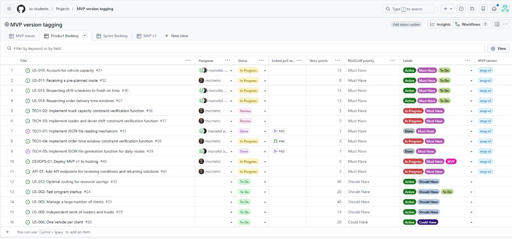
2. **Sprint Backlog view:**  
   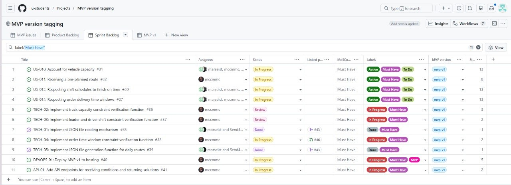
3. **Sprint milestone:**  
   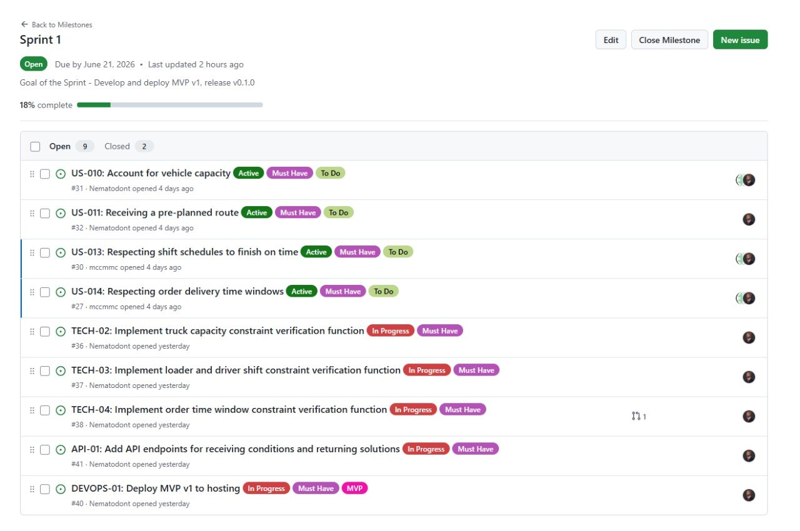
4. **MVP version field, grouped view, or filtered view:**  
   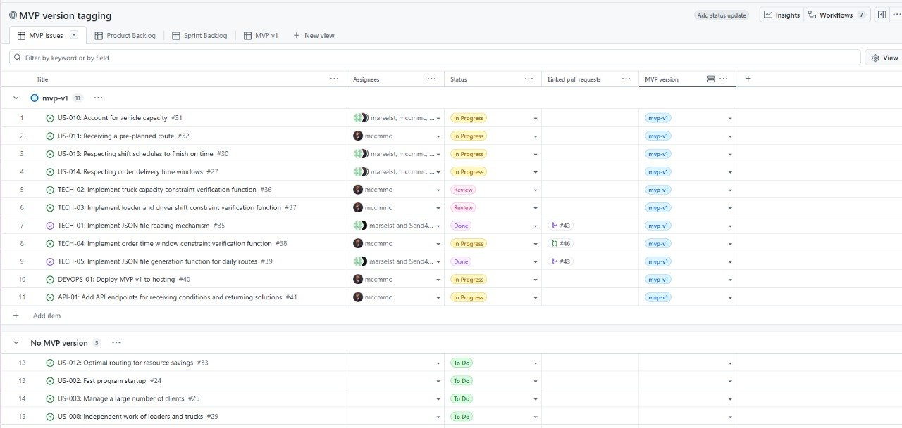
   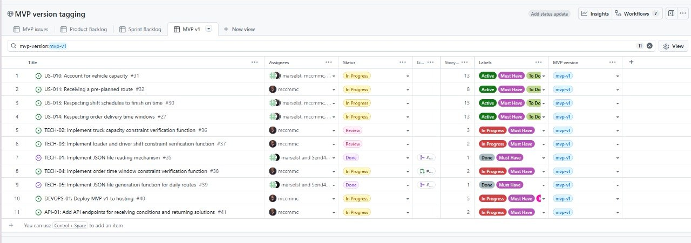
5. **SemVer release:**  
   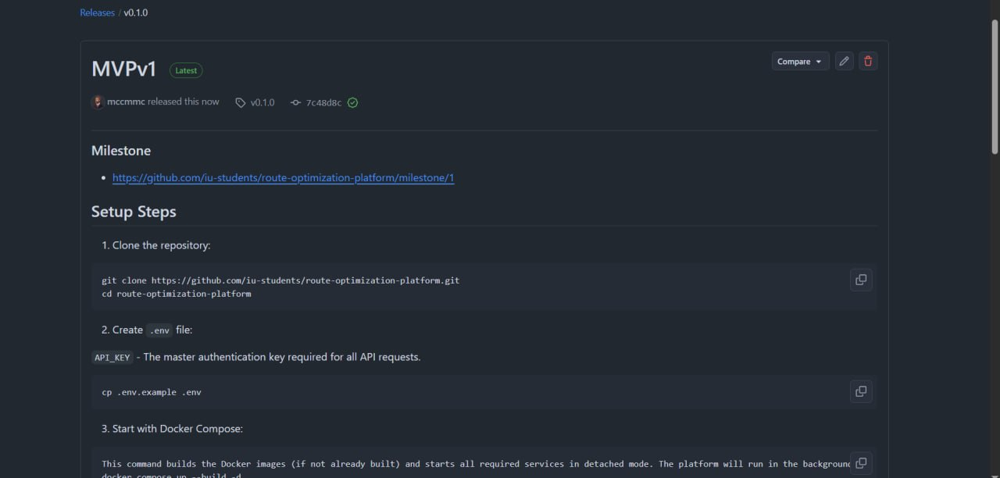

6. **Delivered MVP v1:**  
   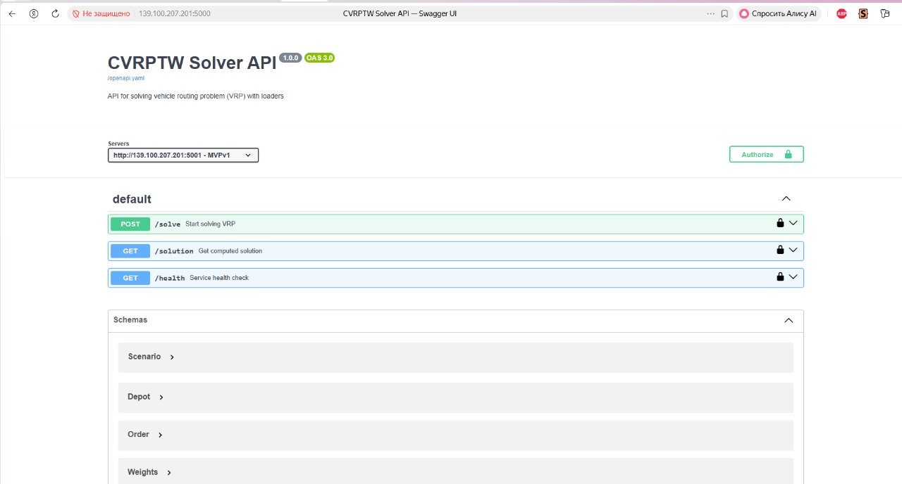
   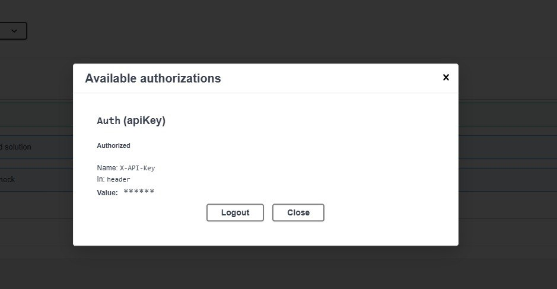
   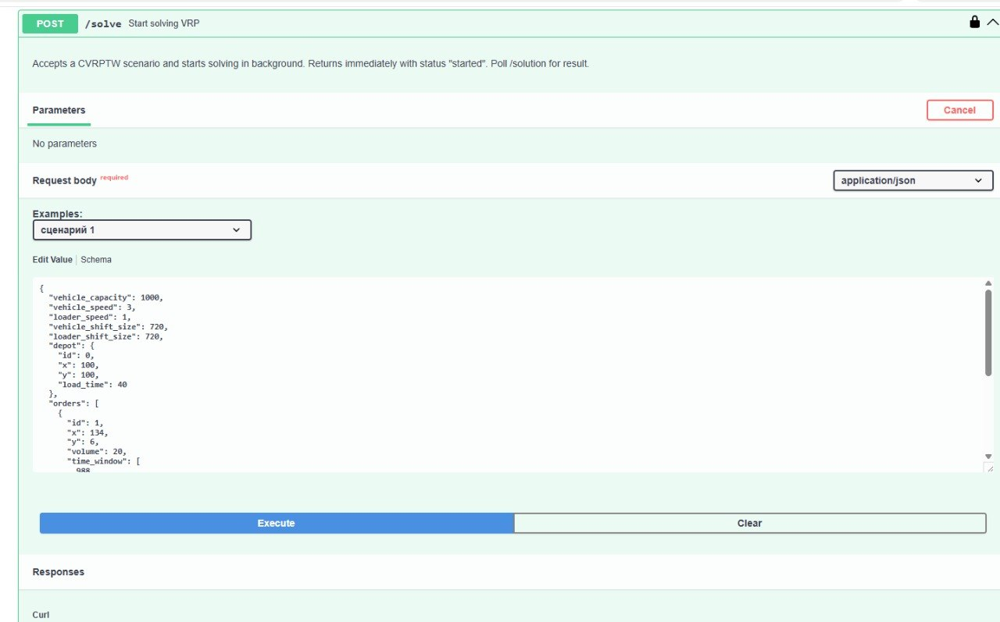
   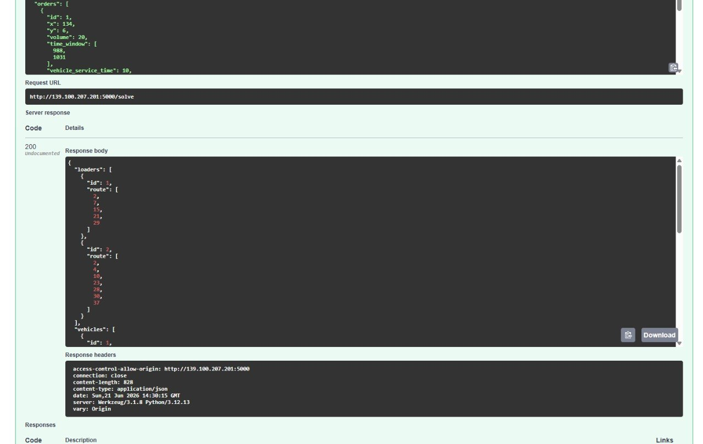
   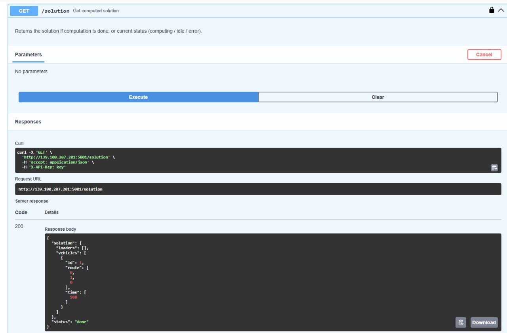
   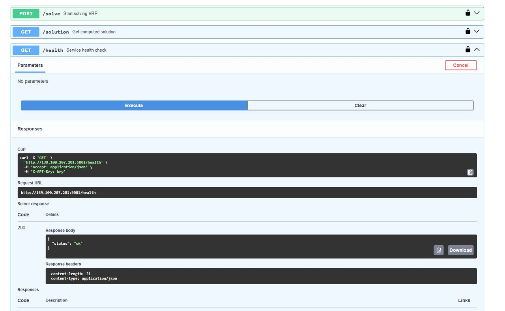
7. **Example reviewed issue-linked PR/MR:**  
   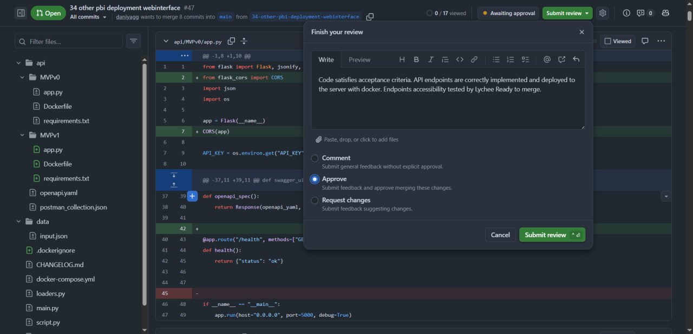
   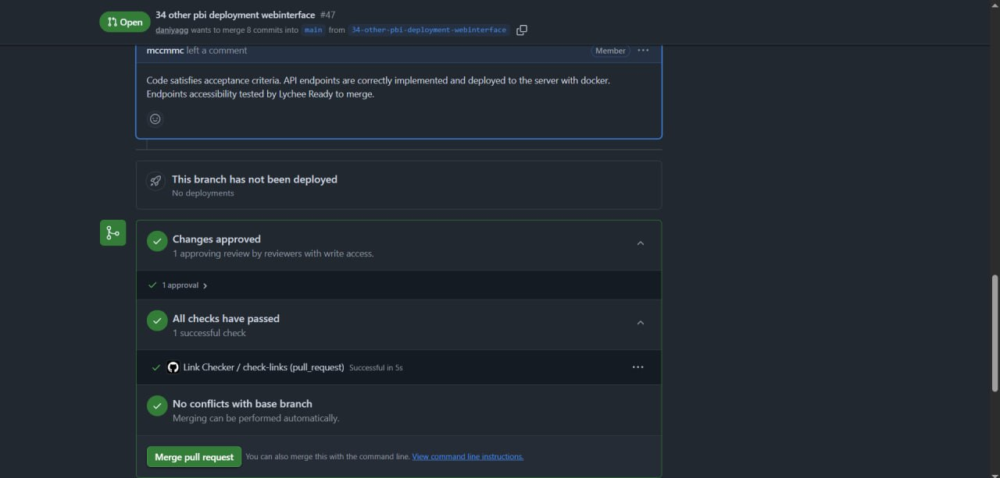
   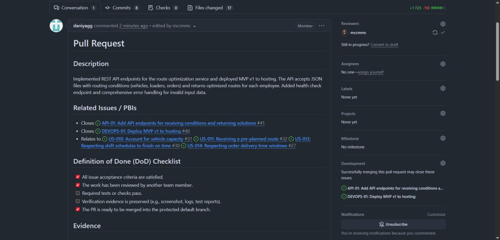

### 30. Link to the published customer review transcript.
[customer-review-transcript.md](./customer-review-transcript.md)

### 31. Link to the customer review summary.
[customer-review-summary.md](./customer-review-summary.md)

### 32. Link to the Week 3 reflection.
[reflection.md](./reflection.md)

### 33. Link to the retrospective.
[retrospective.md](./retrospective.md)

### 34. Link to the LLM report.
[llm-report.md](./llm-report.md)

