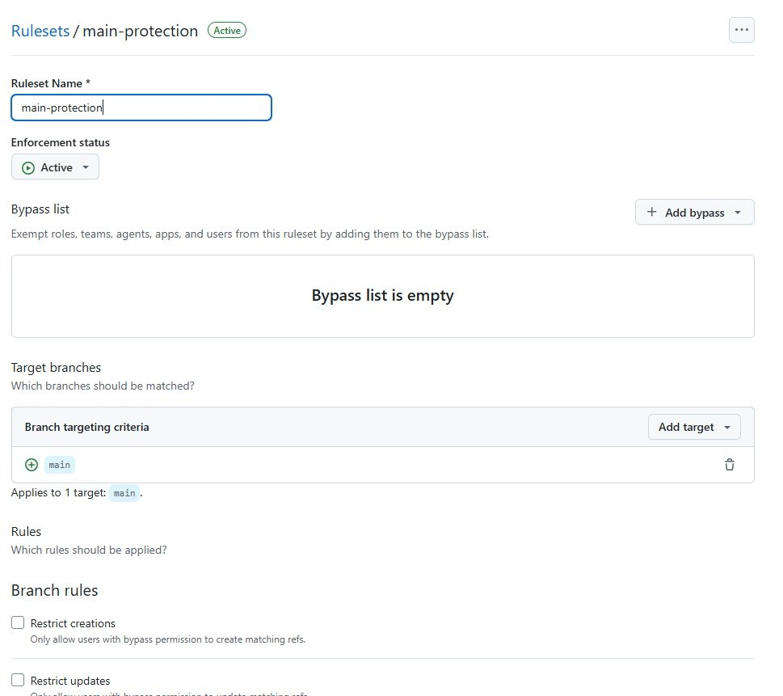
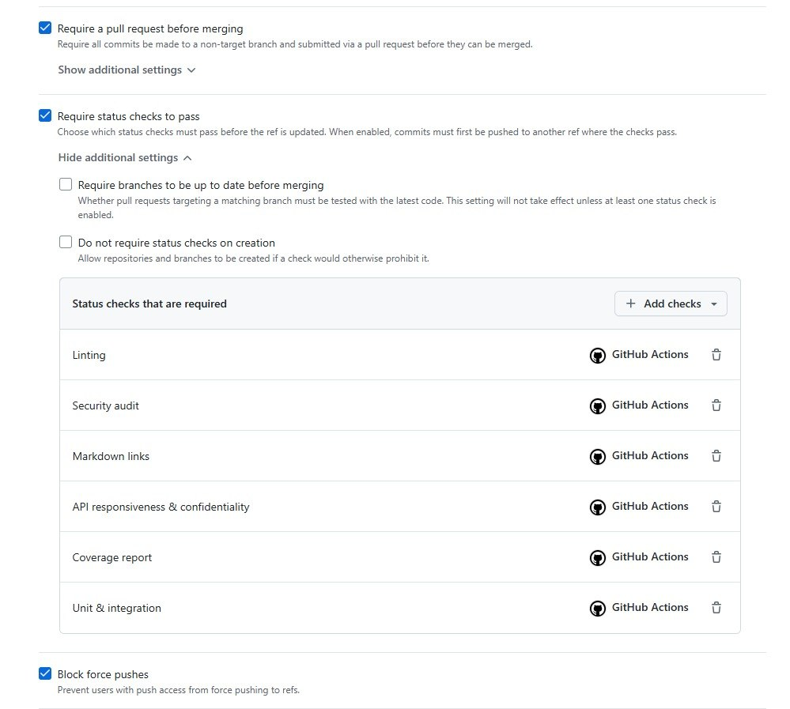
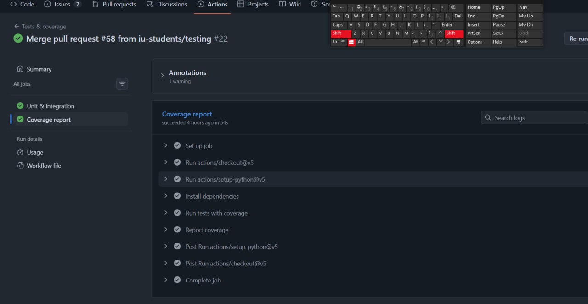
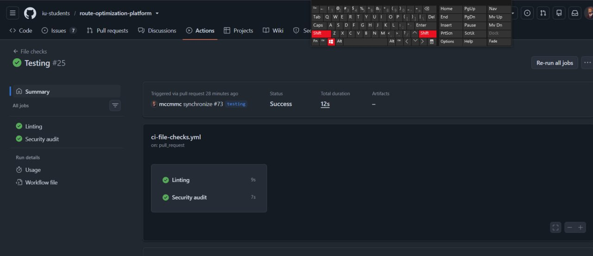
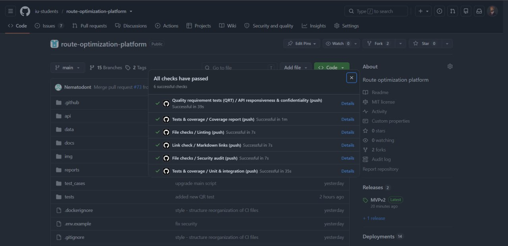
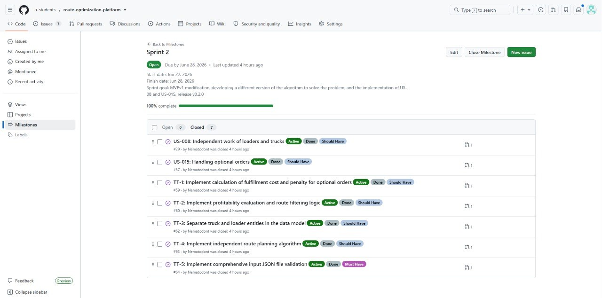
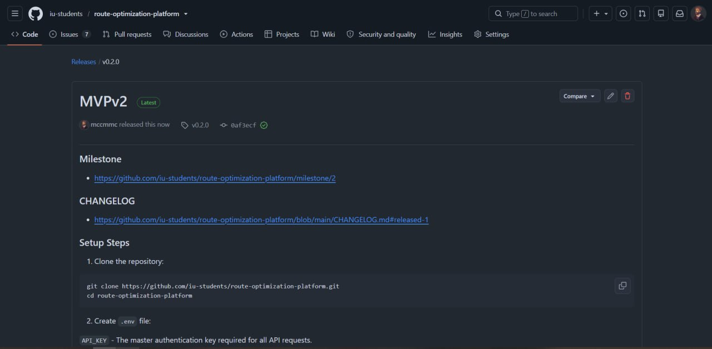
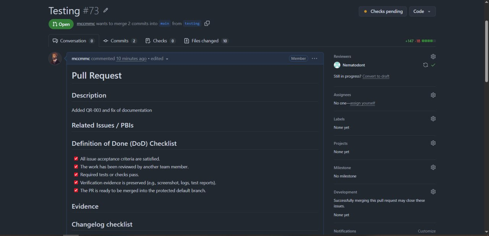
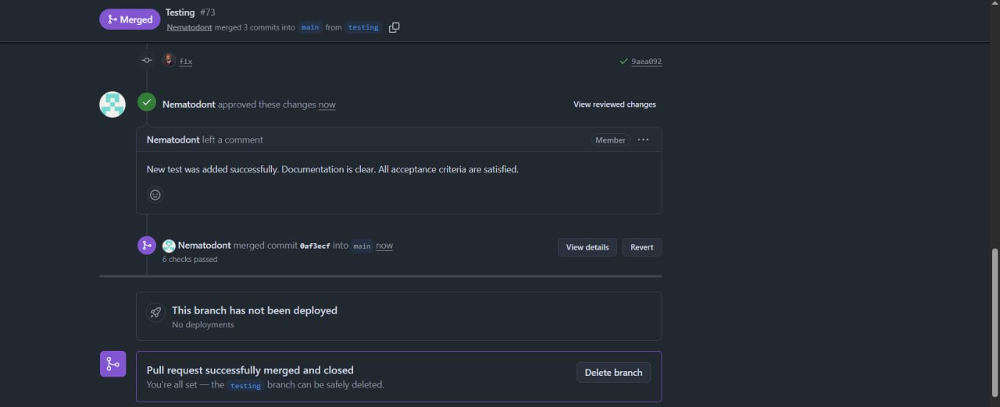

### 1. Project name and short description

**Project Name:** Route Optimization Platform  
**Short Description:** An API service for optimizing delivery logistics, integrating vehicle routing (PyVRP) with greedy and CP-solver-based algorithms to minimize idle time, reduce costs, and maximize shift efficiency for vehicles and loaders.

### 2. Link to the Product Backlog board/view

*   [Product Backlog](https://github.com/orgs/iu-students/projects/1/views/2)

### 3. Link to the Sprint Backlog board/table

*   [Sprint Backlog](https://github.com/orgs/iu-students/projects/1/views/5)

### 4. Link to the Assignment 4 Sprint milestone

*   [Assignment 4 Sprint Milestone](https://github.com/iu-students/route-optimization-platform/milestone/2)

### 5. Sprint Goal, Sprint dates, and short scope summary

**Sprint Goal:** MVPv1 modification, developing a different version of the algorithm to solve the problem, and the implementation of US-08 and US-015, release v0.2.0

**Sprint Dates:**  22.06.2026 - 28.06.2026

**Scope Summary:**
*   Implemented optional order profitability check (skip unprofitable optional orders)
*   Implemented input validation for JSON requests (structure, types, business constraints)
*   Improved greedy algorithm efficiency
*   Continued development of CP-solver-based route generation (version B)
*   Defined quality requirements and automated quality requirement tests
*   Released Sprint increment as `v0.2.0`

### 6. Total Sprint size in Story Points

5 + 13 + 13 + 5 + 5 + 1 + 5 = 47

### 7. Summary of delivered product changes

*   **Optional order handling:** The algorithm now evaluates optional orders for economic viability and  excluded from the route if it is not efficient. 
*   **Input validation:** JSON input files are validated for structure, data types, and business constraints before processing. Invalid requests return error.
*   **Algorithm improvements:** Post-processing profitability check added to the greedy algorithm. CP-solver-based version B redesigned with a new route generation approach covering both vehicles and loaders.
*   **Quality and CI:** Automated unit tests, integration tests, and quality requirement tests added.

### 8. Link to the deployed product

*   [Deployed Product](http://139.100.207.201:5000/docs/)

### 9. Link to current access or run instructions

*   [Access / Run Instructions](../../README.md)

### 10. Customer feedback response table

| Feedback point | Resulting PBI or issue | Status | Response |
|---|---|---|---|
| The client requested to add user stories for optional orders (which may be skipped or not completed) to reduce costs. | [#57](https://github.com/iu-students/route-optimization-platform/issues/57) | Done | Implemented logic to evaluate and skip unprofitable optional orders. If the fulfillment cost exceeds the penalty, the order is excluded from the route. |
| The customer requested adding a story for the manager to view calculation metrics and statistics (objective function). | [#58](https://github.com/iu-students/route-optimization-platform/issues/58) | Not planned for this Sprint | The user story has been added to the backlog, but it has not been included in this sprint. Deferred to focus on algorithm improvements and CI/CD setup. It will be implemented in subsequent sprints |
| The customer requested protection against incorrect requests and invalid input data to prevent system crashes. | [#64](https://github.com/iu-students/route-optimization-platform/issues/64) | Done | Implemented logic to validate data in input JSON file (checking structure, data types, and business constraints) |
| The customer noted the system shows no progress during long calculations - "check status" returns only "processing" indefinitely. | [#71](https://github.com/iu-students/route-optimization-platform/issues/71) | Planned for next Sprint | Logged as TT-6. Will implement a progress indicator and estimated completion time (ETA) for the calculation status endpoint. |

### 11. Explanation of feedback not addressed

*   **Manager metrics dashboard (#58):** Deferred to a later sprint. The team prioritized algorithm correctness, input validation, and CI setup. The user story is in the backlog and will be taken up.
*   **Loader–vehicle algorithm linking:** Significant architectural change. Logged as a backlog task; will be addressed incrementally.

### 12. Link to docs/roadmap.md

*   [roadmap.md](../../docs/roadmap.md)

### 13. Link to docs/definition-of-done.md

*   [definition-of-done.md](../../docs/definition-of-done.md)

### 14. Link to docs/quality-requirements.md

*   [quality-requirements.md](../../docs/quality-requirements.md)

### 15. Link to docs/quality-requirement-tests.md

*   [quality-requirement-tests.md](../../docs/quality-requirement-tests.md)

### 16. Link to docs/testing.md

*   [testing.md](../../docs/testing.md)

### 17. Link to docs/user-acceptance-tests.md

*   [user-acceptance-tests.md](../../docs/user-acceptance-tests.md)

### 18. Summary of the quality model and selected ISO/IEC 25010 sub-characteristics

| ID | Sub-characteristic | Scenario summary |
|---|---|---|
| QR-001 | Performance efficiency - Time behaviour | The API must return an HTTP response (202, 200, or 4xx/5xx) within 2 seconds for 99% of requests to `POST /solve` and `GET /solution`, regardless of whether solver computation has completed. |
| QR-002 | Security - Confidentiality | Any request to a protected endpoint without a valid `X-API-Key` header must be rejected with HTTP 401 and must not expose any input, solution, or system state data. |
| QR-003 | Reliability - Fault tolerance | Any request with missing, invalid, or out-of-range fields to `POST /solve` must be rejected with an appropriate 4xx status and a descriptive error message without crashing the application or corrupting the solver state. |

### 19. Testing status summary
 
**Global repository coverage: 88%**
 
| Critical module | Solution | Type | Line coverage |
|---|---|---|---|
| `script.py` | A | Unit + Integration | 90% |
| `loaders.py` | A | Unit | 89% |
| `main.py` | B | Unit + Integration | 87% |
| `verifier.py` | shared | Unit | 90% |
| `validator.py` | shared | Unit | 82% |
| `tester.py` | shared | Unit | 92% |
| `app.py` | shared | Integration + QRT | 75% |
 
All critical modules exceed the required 30% threshold.
 
Full coverage details: [CI coverage run](https://github.com/iu-students/route-optimization-platform/actions/runs/28297689637/job/83840364456?pr=68)

### 20. Links to unit tests

*   [Unit tests](https://github.com/iu-students/route-optimization-platform/actions/runs/28297689637) - 85 passed (verifier: 11, validator: 26, tester: 13, script: 8, loaders: 5, main: 22)

### 21. Links to integration tests

*   [Integration tests](https://github.com/iu-students/route-optimization-platform/actions/runs/28297689637) - 12 passed (solution A: 6, solution B: 6)

### 22. Links to automated quality requirement tests

*   [Quality requirement tests](https://github.com/iu-students/route-optimization-platform/actions/runs/28297689676)

### 23. Link to the CI pipeline

*   [CI Pipeline](https://github.com/iu-students/route-optimization-platform/actions)

### 24. Link to the latest protected default branch CI run

*   [Latest CI Run](https://github.com/iu-students/route-optimization-platform/actions?query=workflow%3A%22File+checks%22+workflow%3A%22Link+check%22+workflow%3A%22Quality+requirement+tests+%28QRT%29%22+workflow%3A%22Tests+%26+coverage%22+branch%3Amain)

### 25. Branch protection or rules evidence for the protected default branch

Branch protection rules are configured on the default branch. Direct pushes are blocked; all changes require a reviewed and CI-passing pull request before merge.

   
   

### 26. Screenshots or report links for linting, coverage, tests, and the additional QA check

### 27. Short explanation of how Assignment 4 tests, CI checks, QRTs, and Definition of Done will continue to govern later project work

All tests, CI checks, quality requirement tests, and Definition of Done criteria introduced in Assignment 4 are maintained project assets and apply to all future work:

*   New PBIs must pass all CI checks (linting, type checking, tests, coverage) before merge.
*   Quality requirement tests for QR-01, QR-02, and QR-03 must remain passing as the product evolves.
*   The Definition of Done must not be weakened or bypassed in later sprints. If the product stack changes, the DoD and test coverage must be updated accordingly.
*   Coverage thresholds for critical modules (≥ 30% line coverage) are a minimum floor, not a target ceiling.

### 28. Link to the SemVer release mapped to the Assignment 4 Sprint increment

*   [v0.2.0 Release](https://github.com/iu-students/route-optimization-platform/releases/tag/v0.2.0)

### 29. Link to CHANGELOG.md

*   [CHANGELOG.md](../../CHANGELOG.md)

### 30. Public sanitized demo video shorter than two minutes

*   [Demo Video](https://drive.google.com/file/d/1Zu5b-pWxG6FCgpaiTzVedO6UiZbxysmQ/view?usp=drive_link)

### 31. Link to reports/week4/presentation.pdf

*  We don't public presentation

### 32. Public sanitized UAT results summary

**UAT scenarios that passed:**

UAT-001 (Server Health Check) - PASS

UAT-002 (Start Background Solution) - PASS

UAT-003 (Retrieve Solution) - PASS (with comments)

**UAT scenarios that failed or need product changes:**

No scenarios failed outright. However, UAT-003 was marked as "PASS (with comments)" and requires improvements to enhance the user experience during computation.

**Most important feedback points received:**

The customer pointed out that it was unclear how long to wait for a solution (UAT-003), because only the "computing" status was visible without an estimated waiting time or progress indicator.
The calculation process lacks interactivity, users cannot determine when calculations will be completed or how much time remains.
To address this, it was decided to add a waiting time estimate to the status display, providing users with better visibility into the solution retrieval process.

[Resulting PBIs or issues](https://github.com/iu-students/route-optimization-platform/issues/71)

### 33. Link to the published customer review transcript

*   [customer-review-transcript.md](./customer-review-transcript.md)

### 34. Link to reports/week4/customer-review-summary.md

*   [customer-review-summary.md](./customer-review-summary.md)

### 35. Link to reports/week4/reflection.md

*   [reflection.md](./reflection.md)

### 36. Link to reports/week4/retrospective.md

*   [retrospective.md](./retrospective.md)

### 37. Link to reports/week4/llm-report.md

*   [llm-report.md](./llm-report.md)

### 38. Summary of the current product status

The platform delivers a working route optimization API with two parallel algorithm implementations. The greedy-based version (A) is stable and outperforms the baseline on 5 of 10 test cases. The CP-solver-based version (B) is under active development. Input validation and optional order handling are implemented and verified. CI is configured and running on the protected default branch. The system is deployed and accessible for customer testing.

Key remaining gaps: loader and vehicle algorithms are still decoupled, version B skips some mandatory orders, and the system lacks a progress indicator during computation.

### 39. Summary of the next steps

*   Implement a progress indicator / estimated time for the calculation status endpoint
*   Begin linking loader and vehicle algorithms via time window sharing
*   Analyze penalty structure and order coverage gap between algorithm versions
*   Implement manager metrics dashboard (deferred from this sprint)

### 40. Contribution traceability table

| Team Member | Work | PRs / MRs | Review Activity |
|---|---|---|---|
| **Maxim Potushinskii** | Sprint planning, CI configuration, server deployment, docs/roadmap.md update | [#68](https://github.com/iu-students/route-optimization-platform/pull/68) | - |
| **Dania Galieva** |  Wrote user stories and split them to tech tasks, wrote acceptance criteria; wrote week4 documentation (README.md, customer-review-summary.md, retrospective.md, llm-report.md) | - | - |
| **Anastasiia Glinskaia** | Created GitHub issues for Sprint 2; maintained docs/user-acceptance-tests.md, docs/definition-of-done.md; wrote reports/week4/reflection.md; implemented automated quality requirement tests (QRT-001, QRT-002, QRT-003) | - | [#68](https://github.com/iu-students/route-optimization-platform/pull/68) |
| **Timur Iusupov** | [#64](https://github.com/iu-students/route-optimization-platform/issues/64) - CP-solver version B redesign, input validation, baseline metrics | - | - |
| **Marsel Tukhvatullin** | [#57](https://github.com/iu-students/route-optimization-platform/issues/57) ([#59](https://github.com/iu-students/route-optimization-platform/issues/59) [#60](https://github.com/iu-students/route-optimization-platform/issues/60)), [#29](https://github.com/iu-students/route-optimization-platform/issues/29)  ([#62](https://github.com/iu-students/route-optimization-platform/issues/62) [#63](https://github.com/iu-students/route-optimization-platform/issues/63)) - greedy algorithm improvements, optional order handling, independent loader/truck routing | - | - |

### 41. Embedded screenshots from reports/week4/images/

1. **Sprint Milestone:**  
   

2. **Latest protected default branch CI run:**  
   

3. **Branch protection or rules evidence:**  
   
   

4. **Coverage or test report:**  
   

5. **Additional QA check result:**  
   

6. **SemVer release:**  
   

7. **Example reviewed issue-linked PR/MR:**  
   
   
