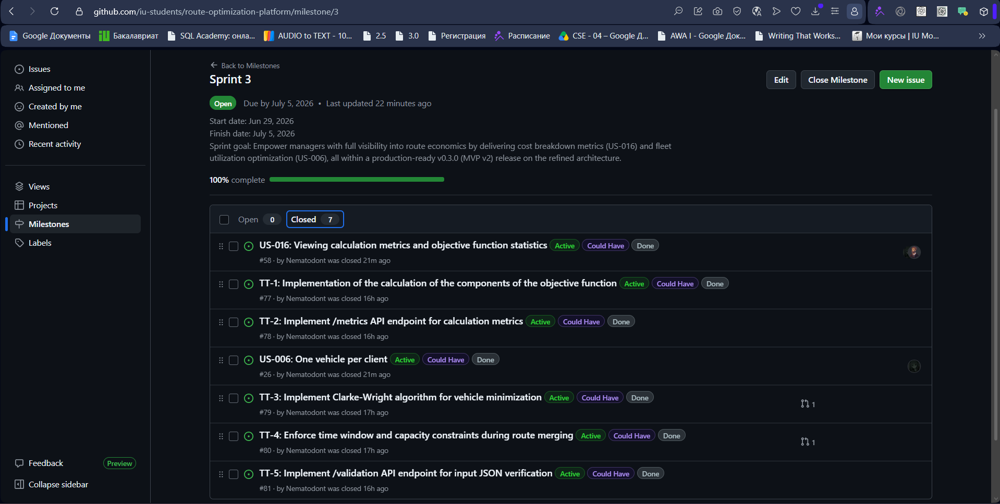
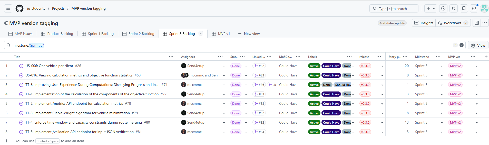
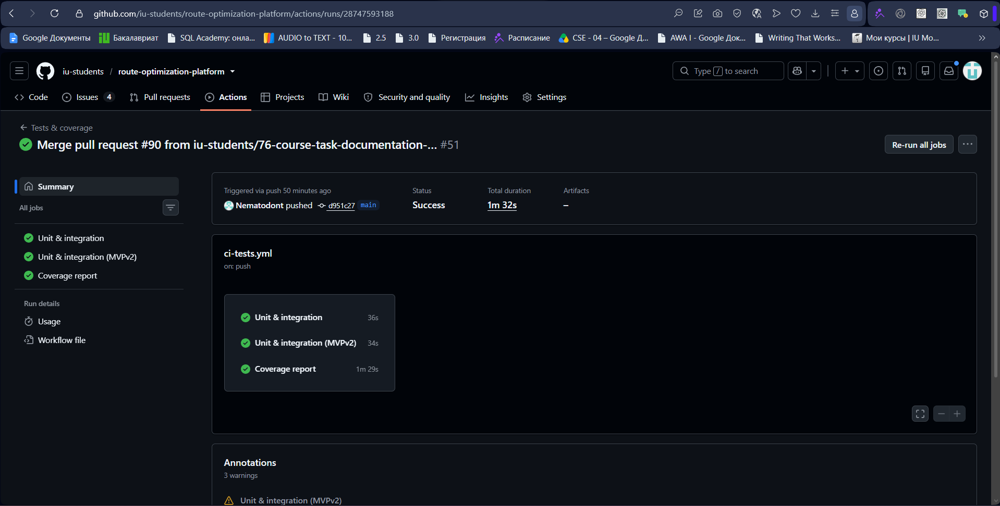
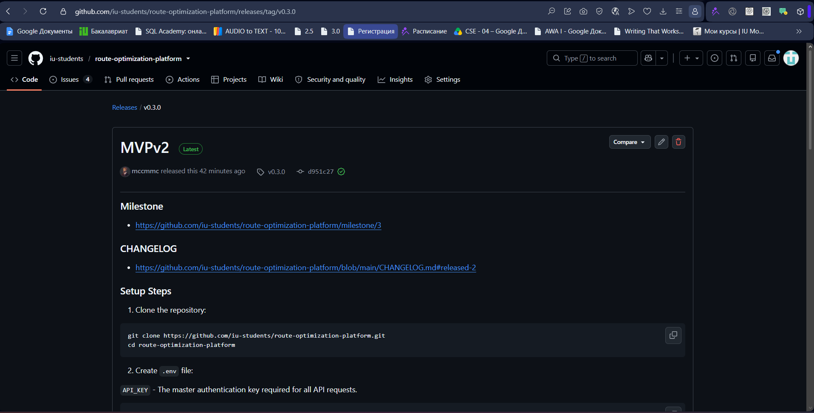
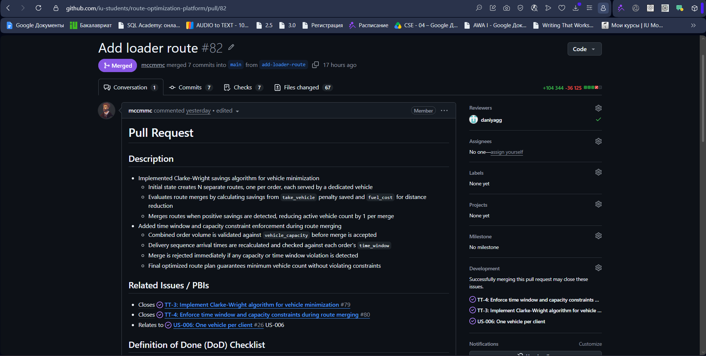
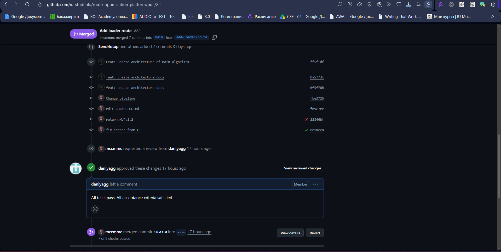
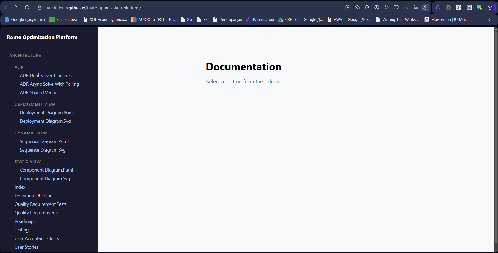

### 1. Project name and short description

**Project Name:** Route Optimization Platform  
**Short Description:** An API service for optimizing delivery logistics, integrating vehicle routing (PyVRP) with greedy and CP-solver-based algorithms to minimize idle time, reduce costs, and maximize shift efficiency for vehicles and loaders.

### 2. Link to the Product Backlog board/view

*   [Product Backlog](https://github.com/orgs/iu-students/projects/1/views/2)

### 3. Link to the Sprint Backlog board/table

*   [Sprint Backlog](https://github.com/orgs/iu-students/projects/1/views/6)

### 4. Link to the Assignment 5 Sprint milestone

*   [Assignment 5 Sprint Milestone](https://github.com/iu-students/route-optimization-platform/milestone/3)

### 5. Sprint Goal, Sprint dates, and short scope summary

**Sprint Goal:** Empower managers with full visibility into route economics by delivering cost breakdown metrics (US-016) and fleet utilization optimization (US-006), all within a production-ready v0.3.0 (MVP v2) release on the refined architecture.

**Sprint Dates:**  29.06.2026 - 05.07.2026

**Scope Summary:**
* Implemented state-based progress indicator during route computation
* Implemented objective function cost breakdown: fuel, vehicle/loader salaries, loader work, penalties
* Extended API response to include cost statistics object(added endpoint `/metrics`)
* Implemented Clarke-Wright savings algorithm for vehicle count minimization
* Implemented `/validation` endpoint for standalone input JSON validation
* Documented system architecture: static, dynamic, and deployment views
* Created Architecture Decision Records (ADRs)
* Released Sprint increment as `v0.3.0`

### 6. Total Sprint size in Story Points

56

### 7. Summary of delivered product changes

*   **Progress indicator:** The `GET /solution` endpoint now returns a state-based progress indicator.
*   **Objective function metrics:** The `GET /metrics` endpoint now includes a `statistics` object with total cost broken down into fuel costs, vehicle salaries, loader salaries, loader work costs, and penalties.
*   **Vehicle minimization:** Clarke-Wright savings algorithm implemented to reduce the number of vehicles used while respecting capacity and time window constraints.
*   **Input validation endpoint:** New `POST /validation` endpoint allows clients to validate input JSON before submitting it for route calculation, returning a boolean result and a list of errors.
*   **Architecture documentation:** Static (component), dynamic (sequence), and deployment diagrams created and stored in `docs/architecture/`.
*   **ADRs:** Architecture Decision Records created documenting key design choices.

### 8. Link to the deployed product

*   [Deployed Product](http://139.100.207.201:5000/docs/)

### 9. Link to current access or run instructions

*   [Access / Run Instructions](../../README.md)

### 10. Customer feedback response table

| Feedback point | Resulting PBI or issue | Status | Response |
|---|---|---|---|
| The customer requested user stories for optional orders (which may be skipped or not completed) to reduce costs. | [#57](https://github.com/iu-students/route-optimization-platform/issues/57) | Done | Implemented logic to evaluate and skip unprofitable optional orders. If the fulfillment cost exceeds the penalty, the order is excluded from the route. |
| The customer requested a story for the manager to view calculation metrics and statistics (objective function). | [#58](https://github.com/iu-students/route-optimization-platform/issues/58) | Done | Implemented a metrics endpoint returning the objective function value broken down into fuel costs, vehicle salaries, loader salaries, loader work costs, and penalties. |
| The customer requested protection against incorrect requests and invalid input data. | [#64](https://github.com/iu-students/route-optimization-platform/issues/64) | Done | Implemented input validation for the JSON file (structure, data types, and business constraints). A dedicated `/valid` endpoint was also added for standalone validation. |
| The customer noted the system shows no progress during long calculations - "check status" returns only "processing" indefinitely. | [#71](https://github.com/iu-students/route-optimization-platform/issues/71) | Done | Implemented a stage-based progress indicator showing which algorithm stage is currently running |
| The customer suggested adding a calculation history feature - a table of past runs with execution time and objective function value. | [#89](https://github.com/iu-students/route-optimization-platform/issues/89) | Planned for next Sprint | Logged as an optional item. Requires persistent storage. Will be considered after higher-priority work is complete. |
| The customer suggested allowing a single vehicle to complete multiple routes per shift to combine short routes. | N/A | Added to Backlog | The customer suggested analyzing the test data first to determine the frequency of using short routes. Under consideration by the team to decide whether it will be beneficial to the algorithm. |
| The customer suggested separating high-volume ("heavy") orders into a dedicated routing iteration. | N/A | Added to Backlog | The team will analyze the distribution of order volumes by scenario to understand how profitable it is to implement this into the algorithm. |

### 11. Explanation of feedback not addressed

*   **Calculation history ([#89](https://github.com/iu-students/route-optimization-platform/issues/89)):** Not implemented in this sprint due to the architectural effort required — it would need persistent storage and a new data layer. The feature was logged as a backlog item and is planned for the next sprint once the core algorithm work is stable.
*   **Multi-route per vehicle:** Not yet implemented. The problem statement allows a single vehicle to complete multiple routes per shift, but the team has not yet analyzed whether the current test scenarios produce enough short routes to make this worthwhile. The team will conduct data analysis first and implement only if the data supports it.
*   **Heavy order separation:** Not yet implemented. Requires analyzing order volume distribution across scenarios to determine whether separating large orders into a dedicated routing pass would improve overall solution quality. The team will conduct data analysis first and implement only if the data supports it.

### 12. Link to docs/roadmap.md

*   [roadmap.md](../../docs/roadmap.md)

### 13. Link to docs/definition-of-done.md

*   [definition-of-done.md](../../docs/definition-of-done.md)

### 14. Link to docs/testing.md

*   [testing.md](../../docs/testing.md)

### 15. Link to docs/quality-requirements.md

*   [quality-requirements.md](../../docs/quality-requirements.md)

### 16. Link to docs/quality-requirement-tests.md

*   [quality-requirement-tests.md](../../docs/quality-requirement-tests.md)

### 17. Link to docs/user-acceptance-tests.md

*   [user-acceptance-tests.md](../../docs/user-acceptance-tests.md)

### 18. Link to docs/development-process.md

*   [development-process.md](../../docs/development-process.md)

### 19. Link to docs/architecture/README.md

*   [architecture/README.md](../../docs/architecture/README.md)

### 20. Links to the static, dynamic, and deployment view artifacts

*   Static view: [directory](../../docs/architecture/static-view/) | [component-diagram.puml](../../docs/architecture/static-view/component-diagram.puml) | [component-diagram.svg](../../docs/architecture/static-view/component-diagram.svg)
*   Dynamic view: [directory](../../docs/architecture/dynamic-view/) | [sequence-diagram.puml](../../docs/architecture/dynamic-view/sequence-diagram.puml) | [sequence-diagram.svg](../../docs/architecture/dynamic-view/sequence-diagram.svg)
*   Deployment view: [directory](../../docs/architecture/deployment-view/) | [deployment-diagram.puml](../../docs/architecture/deployment-view/deployment-diagram.puml) | [deployment-diagram.svg](../../docs/architecture/deployment-view/deployment-diagram.svg)

### 21. Link to the ADR directory or ADR index

*   [ADR directory](../../docs/architecture/adr/)

### 22. Summary of the architecture and how it supports the current product.
Two pipelines solve the same problem: Solution A (CP-SAT) is used by the API, Solutuon B (PyVRP) is run manually. Both share the same data models and the same verifier for checking the final solution. The API does not wait for the solver - it starts it in the background and answers fast, then the user checks later. This fits the product because there is one user at a time, so no need for complex infrastructure.

### 23. Short explanation of how quality requirements are linked to the architecture decisions.
[QR-001](https://github.com/iu-students/route-optimization-platform/blob/main/docs/quality-requirements.md#qr-001-api-responsiveness) (fast API) explains the async design (ADR-002) - the API never waits for the solver. [QR-002](https://github.com/iu-students/route-optimization-platform/blob/main/docs/quality-requirements.md#qr-002-route-data-confidentiality) (data protection) explains why input is validated before reaching the solver. [QR-003](https://github.com/iu-students/route-optimization-platform/blob/main/docs/quality-requirements.md#qr-003-critical-module-testability) (testable code) explains two things: why duplicated logic in two pipelines was accepted (ADR-001), and why the verifier is now shared instead of duplicated (ADR-003).

### 24. Testing and CI status summary for the delivered increment.
**Testing and CI status summary:** All 5 QRT suites pass (API responsiveness, confidentiality, critical module coverage, solver completion time, docs availability). Unit tests: 85+ passing across verifier, validator, tester, script, loaders, main, and integration suites. Coverage: every critical module ≥30% (global 88%). CI: latest `main` run passing — linting (flake8), unit/integration tests, coverage, pip-audit, Lychee link checks. New for MVP v2: QRT-004 (solver <900s) and QRT-005 (hosted docs HTTP 200) added.

See [docs/testing.md](../../docs/testing.md), [docs/quality-requirement-tests.md](../../docs/quality-requirement-tests.md), [CI pipeline](https://github.com/iu-students/route-optimization-platform/actions)

### 25. Link to the CI pipeline.
*   [CI Pipeline](https://github.com/iu-students/route-optimization-platform/actions)

### 26. Link to the latest protected-default-branch CI run.
[Latest CI Run](https://github.com/iu-students/route-optimization-platform/actions/runs/28747593188)

### 27. Link to the SemVer release mapped to MVP v2
*  [v0.3.0 Release (MVP v2)](https://github.com/iu-students/route-optimization-platform/releases/tag/v0.3.0)

### 28. Link to CHANGELOG.md
*   [CHANGELOG.md](../../CHANGELOG.md)

### 29. Public sanitized demo video shorter than two minutes.
https://drive.google.com/file/d/15Vnb-TNkAKht34yijP4GshS_SAII8Dr5/view?usp=drive_link

### 30. Public sanitized UAT results summary.
Summary for the report:

UAT scenarios that passed:

UAT-001 (Server Health Check) — PASS

UAT-002 (Start Background Solution) — PASS

UAT-003 (Retrieve Solution) — PASS (with comments)

UAT-004 (Retrieving Computational Metrics) — PASS

UAT-005 (Input Data Validation Check) — PASS

UAT scenarios that failed or need product changes:

No scenarios failed outright. However, UAT-003 was marked as "PASS (with comments)" and requires improvements to enhance the user experience during computation. The feedback from the previous execution (June 27, 2026) regarding the lack of progress visibility has been partially addressed through the new metrics endpoint (UAT-004), but the core progress indication during long-running computations still needs attention.

What still needs to be fixed in the product:

- The system shows no progress during long calculations — "check status" returns only "processing" indefinitely without indicating which stage is currently in progress

- Users cannot distinguish between "still computing" and "crashed/frozen" states

- A stage-based progress indicator is needed showing which algorithm stage is currently in progress and how many stages remain

Most important feedback points received:

Progress visibility during computation (UAT-003): The customer noted the system shows no progress during long calculations — "check status" returns only "processing" indefinitely. They requested a stage-based progress indicator rather than a simple time estimate, showing which algorithm stage is currently in progress and how many stages remain. We will add new technical tasks related to this problem in next Sprint.

**Resulting PBIs or issues:** [#71](https://github.com/iu-students/route-optimization-platform/issues/71), [#77](https://github.com/iu-students/route-optimization-platform/issues/77), [#78](https://github.com/iu-students/route-optimization-platform/issues/78), [#58](https://github.com/iu-students/route-optimization-platform/issues/58), [#81](https://github.com/iu-students/route-optimization-platform/issues/81)

### 31. Link to the hosted documentation site.
*  [documentation](https://iu-students.github.io/route-optimization-platform/)

### 32. Link to the published Sprint Review transcript
*   [customer-review-transcript.md](./customer-review-transcript.md)

### 33. If any artifact, evidence pattern, or access arrangement differs from the expected default, justify that deviation explicitly.

No such artifact, evidence pattern, or access arrangement.

### 34. Link to reports/week5/sprint-review-summary.md

*   [sprint-review-summary.md](./sprint-review-summary.md)

### 35. Link to reports/week5/reflection.md

*   [reflection.md](./reflection.md)

### 36. Link to reports/week5/retrospective.md

*   [retrospective.md](./retrospective.md)

### 37. Link to reports/week5/llm-report.md

*   [llm-report.md](./llm-report.md)

### 38. Summary of the current product status.
The platform delivers a production-ready v0.3.0 (MVP v2) route optimization API. The project architecture has been reviewed and cleaned up. Key new features implemented this Sprint include a manager metrics endpoint (/metrics), an input JSON validation endpoint (/valid), and a state-based progress indicator.

Regarding algorithm performance, the CP-solver-based algorithm (extended to account for loader costs when evaluating optional order removal) now outperforms the baseline on 8 out of 10 test cases within the 15-minute time limit. A new parallel algorithm version (building vehicles and loaders simultaneously without PyVRP, using iterative point removal and reinsertion) is also in active development. The CP-solver version is still facing time-limit exceeded issues on some test cases. The system is deployed.

### 39. Summary of the next steps.
*  Algorithm improvement research: Analyze short-route frequency in the test data to decide whether a single vehicle can complete multiple routes per shift
*   Algorithm improvement research: Analyze order-volume distribution to evaluate separating high-volume orders into a dedicated routing iteration
*  Explore VRP heuristics: Investigate 2-opt and 3-opt heuristics as potential standalone improvement steps for the current routing algorithm.
*  Calculation history feature: Implement persistent storage and a /history endpoint to store past calculation metrics and solutions.
*  Refactor CP-solver version: Optimize the CP-solver algorithm to stay within the 15-minute limit while accounting for loader costs.

### 40. Contribution traceability table.
| Team Member | Work | PRs / MRs | Review Activity |
|---|---|---|---|
| **Maxim Potushinskii** | Sprint planning, CI configuration, server deployment (v0.3.0), `docs/roadmap.md` update, architecture review | [#82](https://github.com/iu-students/route-optimization-platform/pull/82), [#83](https://github.com/iu-students/route-optimization-platform/pull/83), [#84](https://github.com/iu-students/route-optimization-platform/pull/84), [#85](https://github.com/iu-students/route-optimization-platform/pull/85), [#86](https://github.com/iu-students/route-optimization-platform/pull/86), [#87](https://github.com/iu-students/route-optimization-platform/pull/87), [#88](https://github.com/iu-students/route-optimization-platform/pull/88), [#90](https://github.com/iu-students/route-optimization-platform/pull/90) | - |
| **Dania Galieva** | Refined user stories (US-016, US-006) and split them into tech tasks (TT-7, TT-8, TT-9, TT-10, TT-11); wrote Week 5 documentation (README.md, customer-review-summary.md, retrospective.md, llm-report.md) | - | [#82](https://github.com/iu-students/route-optimization-platform/pull/82), [#83](https://github.com/iu-students/route-optimization-platform/pull/83), [#84](https://github.com/iu-students/route-optimization-platform/pull/84), [#85](https://github.com/iu-students/route-optimization-platform/pull/85), [#86](https://github.com/iu-students/route-optimization-platform/pull/86), [#87](https://github.com/iu-students/route-optimization-platform/pull/87), [#88](https://github.com/iu-students/route-optimization-platform/pull/88) |
| **Anastasiia Glinskaia** | Created GitHub issues for Sprint 3; maintained `docs/user-acceptance-tests.md` and `docs/definition-of-done.md`; wrote `reports/week5/reflection.md`; implemented automated quality requirement tests (QRT-001, QRT-002, QRT-003) | - | [#90](https://github.com/iu-students/route-optimization-platform/pull/90) |
| **Timur Iusupov** | Clarke-Wright savings algorithm for vehicle count minimization; constraint validation during route merging; metrics calculation logic; architecture documentation (static, dynamic, deployment views); ADRs (ADR-001, ADR-002, ADR-003) | - | - |
| **Marsel Tukhvatullin** | Implemented the new iterative route optimization algorithm: greedy initial assignment of vehicles and loaders, followed by iterative removal of 5–10% of points and reinsertion into existing routes. Applies a perturbation step (removing 30–50% of points) when no significant improvement is observed. Achieves ~8000 iterations on the largest test case (1000 points). | - | - |

### 41. Embedded screenshots from reports/week5/images/

1. **Sprint Milestone:**  
   

2. **Board or project workflow view:**  
   

3. **Latest protected default branch CI run:**  
   

4. **SemVer release:**  
   

5. **Example reviewed issue-linked PR/MR:**  
   
   
6. **Hosted docs site:**
   
