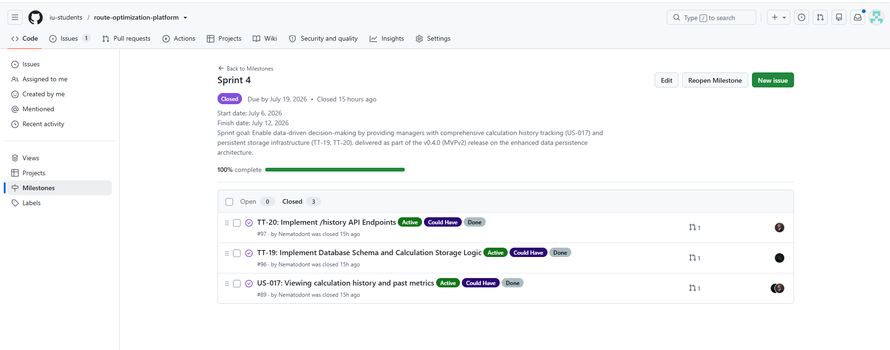
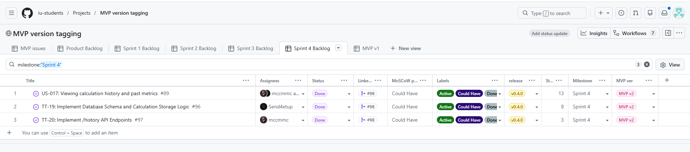
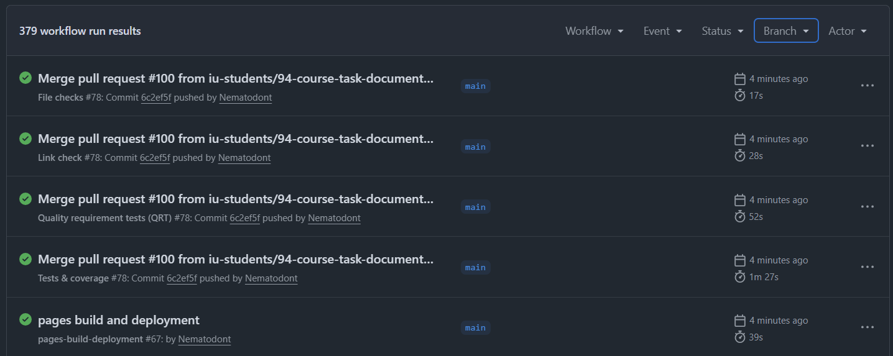
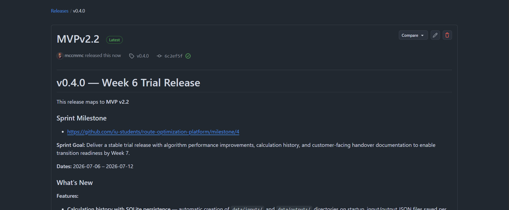
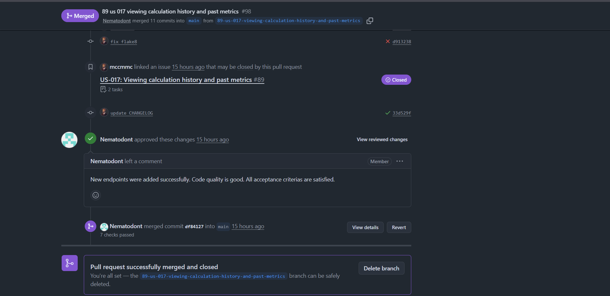
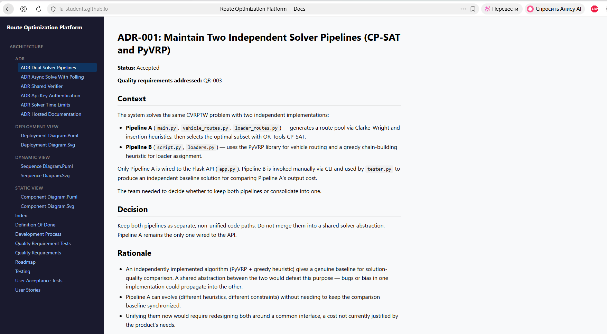

### 1. Project name and short description

**Project Name:** Route Optimization Platform  
**Short Description:**  A logistics optimization system that solves the CVRPTW problem - efficient routing of vehicles considering time windows and load capacity.

### 2. Link to the Product Backlog board/view

*   [Product Backlog](https://github.com/orgs/iu-students/projects/1/views/2)

### 3. Link to the Sprint Backlog board/table

*   [Sprint Backlog](https://github.com/orgs/iu-students/projects/1/views/7)

### 4. Link to the Assignment 6 Sprint milestone

*   [Assignment 6 Sprint Milestone](https://github.com/iu-students/route-optimization-platform/milestone/4)

### 5. Sprint Goal, Sprint dates, and short scope summary

**Sprint Goal:** 
Enable data-driven decision-making by providing managers with comprehensive calculation history tracking (US-017) and persistent storage infrastructure (TT-19, TT-20), delivered as part of the v0.4.0 (MVPv2) release on the enhanced data persistence architecture.

**Sprint Dates:** 06.07.2026 - 12.07.2026

**Scope Summary:**
* Implemented calculation history feature (US-017) with database integration to track past runs.
* Integrated multi-route per vehicle logic into the CP-solver algorithm.
* Adjusted algorithm time limits to ensure all cases run within 10–14 minutes.
* Prepared customer-facing documentation for handover (`docs/customer-handover.md`, `CONTRIBUTING.md`, `AGENTS.md`).
* Polished root `README.md` to serve as the main public entry point.
* US-012 was transferred to quality requirement. 
* Released Sprint increment as `v0.4.0` 

### 6. Total Sprint size in Story Points
24

### 7. Summary of the Week 6 trial-release changes.
*   **Calculation history (US-017):** Implemented database integration and endpoints (`/history`, `/history/{id}`) to track past runs, execution time, and objective function metrics.
*   **Algorithm improvements (CP-solver):** Integrated multi-route per vehicle logic. Adjusted time limits for route generation and CP Solver. The algorithm now outperforms the baseline on 9 out of 10 test cases within 10–14 minutes.
*   **Algorithm improvements (iterative):** Implemented point removal and reinsertion logic (currently in testing).
*   **Repository preparation for handover:** Created `CONTRIBUTING.md`, `AGENTS.md`, and `docs/customer-handover.md`. Updated root `README.md` to serve as the main public entry point.

### 8. Link to the Week 6 product access artifact.

*   [Deployed Product](http://139.100.207.201:5000/docs/)

### 9. Link to current access or run instructions

*   [Access / Run Instructions](../../README.md#setup-steps)

### 10. Link to README.md

*   [README.md](../../README.md)

### 11. Link to CONTRIBUTING.md
 
*   [CONTRIBUTING.md](../../CONTRIBUTING.md)

### 12. Link to AGENTS.md
 
*   [AGENTS.md](../../AGENTS.md)

### 13. Link to docs/customer-handover.md
 
*   [customer-handover.md](../../docs/customer-handover.md)

### 14. Link to the hosted documentation site
 
*   [Hosted Documentation](https://iu-students.github.io/route-optimization-platform/)

### 15. Summary of the customer-facing documentation review

The customer has reviewed the new transfer/collaboration manuals. He confirmed that the storage structure and documentation are sufficient for the transition. Files ("docs/customer-handover.md", "CONTRIBUTING.md `, `AGENTS.md `) were sent to the customer via live chat for final approval after the meeting. The customer has confirmed the files.

### 16. Transition-readiness summary

The customer confirmed the product is functionally ready for transition. The handover process will involve granting admin rights and the customer deploying the solution locally to verify it. 
**What must still happen in Week 7:** The customer attempts independent deployment, and the team resolves the remaining 2% gap on test case 4 to finalize the product.

### 17. Customer feedback response table with feedback points and resulting PBIs or issues.

| Feedback point | Resulting PBI or issue | Status | Response |
|---|---|---|---|
| The customer suggested adding a calculation history feature - a table of past runs with execution time and objective function value. | [#89](https://github.com/iu-students/route-optimization-platform/issues/89) | Done | History was done by customer request. |
| The customer suggested using a threshold to switch algorithms based on order count. | N/A | Added to Backlog | The team will study this approach and how reasonable an automatic switcher based on general parameters (e.g., order count < 100). |

### 18. Explanation of feedback not addressed
*   **Test case 4 gap:** The algorithm currently underperforms the baseline by 2% on the 4th test case due to vehicle routing issues. This is under active investigation for the final `MVP v3` release.
*  **Switcher:** The team needs to investigate how rational it would be to make the switch or better refine one complete algorithm.  

### 19. Link to docs/roadmap.md

*   [roadmap.md](../../docs/roadmap.md)

### 20. Link to the maintained quality, testing, architecture, development-process, and other customer-relevant documentation updated during Sprint 4.

*   [Architecture Documentation](../../docs/architecture/README.md)
*   [Quality Requirements](../../docs/quality-requirements.md)
*   [Testing Strategy & CI](../../docs/testing.md)
*   [Development Process](../../docs/development-process.md)
*   [Definition of Done](../../docs/definition-of-done.md)
*   [User Acceptance Tests](../../docs/user-acceptance-tests.md)

### 21. Summary of relevant UAT or customer-trial results.

UAT scenarios that passed:

UAT-001 (Server Health Check) — PASS

UAT-002 (Start Background Solution) — PASS

UAT-003 (Retrieve Solution) — PASS

UAT-004 (Retrieving Computational Metrics) — PASS

UAT-005 (Input Data Validation Check) — PASS

UAT-006: View Calculation History —  PASS

UAT-007: View Calculation Details by Request ID —  PASS

UAT scenarios that failed or need product changes:

No scenarios failed. All scenarios passed without any outstanding issues or required product changes.

What still needs to be fixed in the product:

Nothing. All identified issues from previous test executions have been fully resolved in version v0.4.0:

Stage-based progress indicator implemented (shows: starting, parsing, solving, solving_vehicles, solving_loaders, feedback_iteration)
History and calculation details endpoints successfully implemented

Most important feedback points received:

The customer confirmed that all issues have been resolved and the product fully meets their expectations.

Resulting PBIs or issues (All Resolved and Closed):

[#71](https://github.com/iu-students/route-optimization-platform/issues/71), 
[#77](https://github.com/iu-students/route-optimization-platform/issues/77),
[#78](https://github.com/iu-students/route-optimization-platform/issues/78),
[#58](https://github.com/iu-students/route-optimization-platform/issues/58),
[#81](https://github.com/iu-students/route-optimization-platform/issues/81),
[#89](https://github.com/iu-students/route-optimization-platform/issues/89),
[#96](https://github.com/iu-students/route-optimization-platform/issues/96),
[#97](https://github.com/iu-students/route-optimization-platform/issues/97)

### 22. Link to the Week 6 SemVer trial release.
*  [SemVer](https://github.com/iu-students/route-optimization-platform/releases/tag/v0.4.0) 

### 23. Link to CHANGELOG.md
*   [CHANGELOG.md](../../CHANGELOG.md)

### 24. Link to the published Sprint Review transcript
*   [sprint-review-transcript.md](./sprint-review-transcript.md)

### 25. Link to reports/week6/sprint-review-summary.md.

*   [sprint-review-summary.md](./sprint-review-summary.md)

### 26. Link to reports/week6/reflection.md.

*   [reflection.md](./reflection.md)

### 27. Link to reports/week6/retrospective.md.

*   [retrospective.md](./retrospective.md)

### 28. Link to reports/week6/llm-report.md.

*   [llm-report.md](./llm-report.md)

### 29. Summary of the current product status.
The platform is at the trial-release stage and is functionally ready for customer handover. Key recent updates include the successful implementation of the calculation history feature (US-017) with database integration, allowing managers to track past runs, execution times, and objective function metrics.

Regarding algorithm performance, the primary CP-solver algorithm (integrated with multi-route per vehicle logic) now outperforms the baseline on 9 out of 10 test cases, with all cases resolving within the 10–14 minute limit. The alternative iterative algorithm (point removal and reinsertion) remains under active development, currently lacking vehicle depot-return logic. The only remaining algorithmic gap is test case 4, where the primary solver underperforms the baseline by approximately 2%.

The repository has been fully prepared for transition, including the creation of `docs/customer-handover.md`, `CONTRIBUTING.md`, and `AGENTS.md`. The customer has confirmed transition readiness and is scheduled to attempt an independent deployment of the solution during Week 7.

### 30. Contribution traceability table.
| Team Member | Work | PRs / MRs | Review Activity |
|---|---|---|---|
| **Maxim Potushinskii** | Customer meeting organization, server deployment, Sprint planning, CI configuration, history endpoint implementation, CHANGELOG update, SemVer release, demo video recording, presentation preparation | [#95](https://github.com/iu-students/route-optimization-platform/pull/95), [#98](https://github.com/iu-students/route-optimization-platform/pull/98), [#99](https://github.com/iu-students/route-optimization-platform/pull/99), [#100](https://github.com/iu-students/route-optimization-platform/pull/100) | - |
| **Dania Galieva** | User stories refinement, backlog management, customer feedback response, Week 6 documentation (week6/README.md, sprint-review-summary.md, transcript, retrospective, LLM report), root README.md correction, final PDF compilation | - | - |
| **Anastasiia Glinskaia** | GitHub issues creation, UAT coordination, maintained `docs/user-acceptance-tests.md`, created `docs/customer-handover.md`, updated `docs/roadmap.md`, wrote `reports/week6/reflection.md` | - | [#95](https://github.com/iu-students/route-optimization-platform/pull/95), [#98](https://github.com/iu-students/route-optimization-platform/pull/98), [#99](https://github.com/iu-students/route-optimization-platform/pull/99), [#100](https://github.com/iu-students/route-optimization-platform/pull/100) |
| **Timur Iusupov** | Algorithm implementation (CP Solver multi-route integration, time limit tuning), calculation history feature with database integration, created `CONTRIBUTING.md` and `AGENTS.md`, algorithm metrics spreadsheet | - | - |
| **Marsel Tukhvatullin** | Algorithm implementation (iterative route optimization, point removal and reinsertion), vehicle depot-return logic implementation, algorithm debugging and testing | - | - |

### 31. Embedded screenshots from reports/week6/images/
1. **Sprint Milestone:**  
   

2. **Board or project workflow view:**  
   

3. **Latest protected default branch CI run:**  
   

4. **SemVer release:**  
   

5. **Example reviewed issue-linked PR/MR:**  
   

6. **Hosted docs site:**  
   
