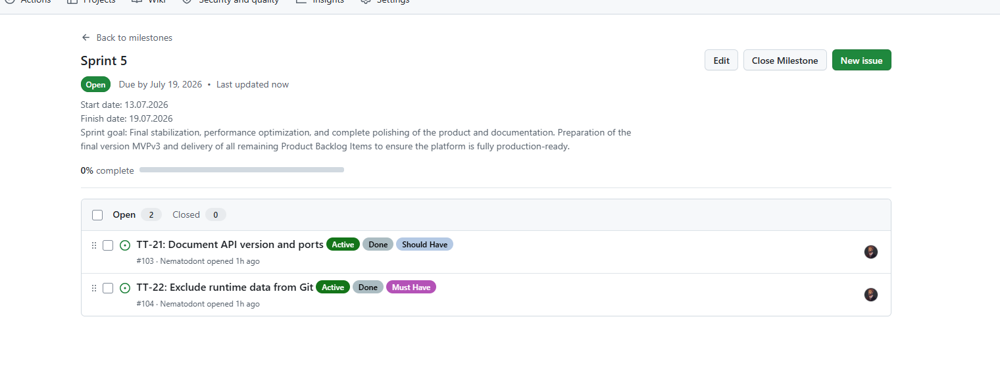
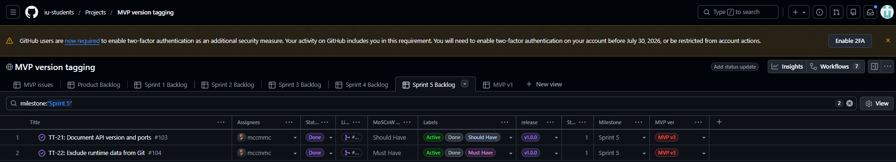
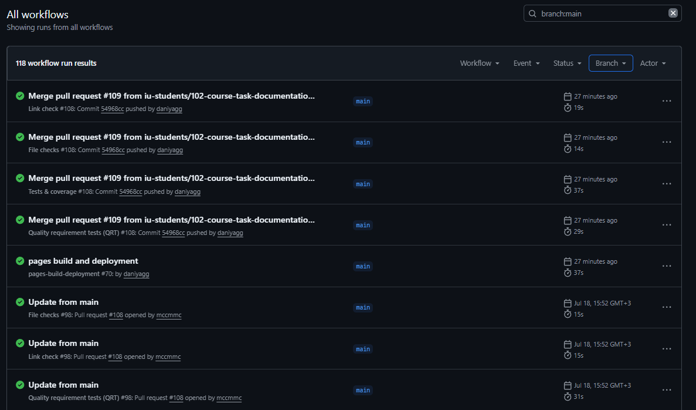
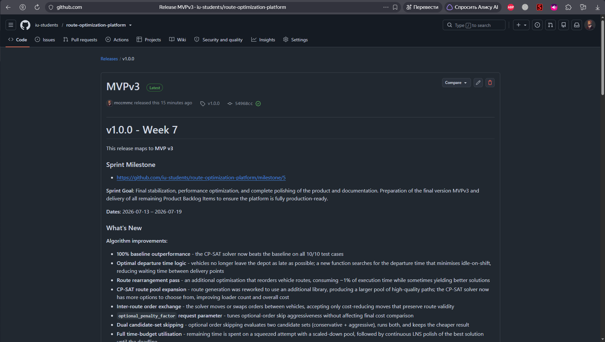
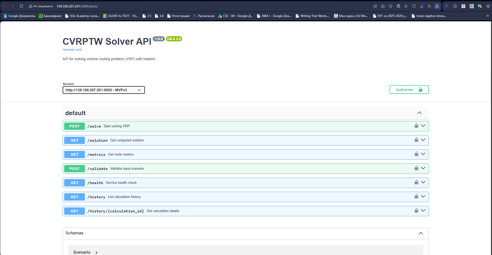
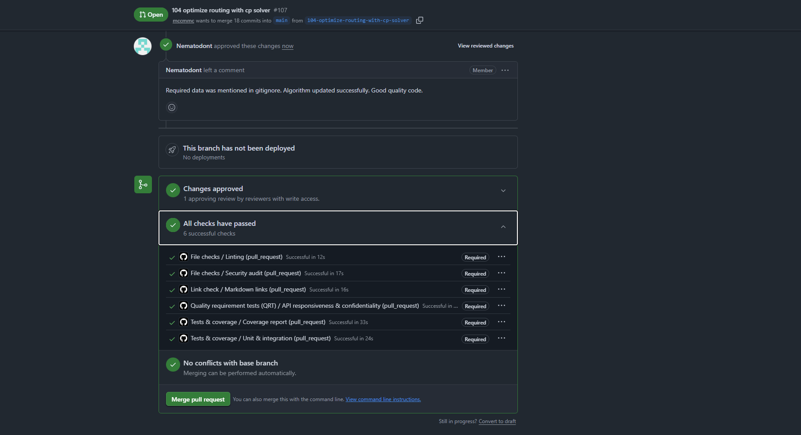
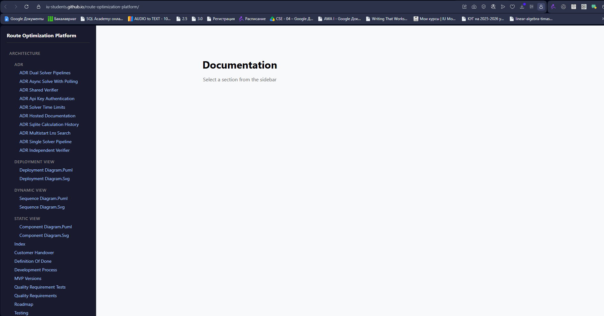

**Project Name:** Route Optimization Platform  
**Short Description:**  A logistics optimization system that solves the CVRPTW problem - efficient routing of vehicles considering time windows and load capacity.

### 1. Link to Week 6 Report
*   [Week 6 Report](../week6/README.md)

### 2. Link to the Product Backlog board or view
*   [Product Backlog](https://github.com/orgs/iu-students/projects/1/views/2)

### 3. Link to the Sprint 5 Backlog board or view
*   [Sprint Backlog](https://github.com/orgs/iu-students/projects/1/views/8) 

### 4. Link to the Sprint 5 milestone
*   [Assignment 6 Sprint Milestone](https://github.com/iu-students/route-optimization-platform/milestone/5)

### 5. Sprint Goal, Sprint dates, and short scope summary
**Sprint Goal:** Final stabilization, performance optimization, and complete polishing of the product and documentation. Preparation of the final version MVPv3 and delivery of all remaining Product Backlog Items to ensure the platform is fully production-ready.

**Sprint Dates:** 13.07.2026 - 19.07.2026

**Scope Summary:**
* Optimized algorithm to beat baseline on 100% of tests (10/10).
* Fixed `.gitignore` for runtime data and updated API port documentation.
* Finalized repository handover and administrator rights transfer.

### 6. Total Sprint size in Story Points
2

### 7. Summary of the Week 7 follow-up maintenance and final `MVP v3` changes
*   **Algorithm Improvement:** The primary algorithm now completely outperforms the baseline across all 10 test cases. Key fixes included optimizing vehicle departure times from the depot, rearranging routes, and running multiple iterations for small input sizes to avoid suboptimal routes. Enhanced CP Solver route generation to expand the route pool, yielding a ~2% improvement on specific cases.
*   **Documentation and Security Fixes:** Added `data/inputs/`, `data/outputs/`, and `data/history.db` to `.gitignore` to prevent data leaks. Updated customer-facing documentation regarding network ports and clarified the active API version (v3).
*   **Handover Completion:** Administrator rights to the repository were formally transferred to the customer. The solution remains deployed on the university VM via a public IP tunnel.

### 8. Link to the final product access artifact
*   [Deployed Product](http://139.100.207.201:5000/docs/)

### 9. Link to current access or run instructions
*   [Access / Run Instructions](../../README.md#setup-steps)

### 10. Link to README.md
*   [README.md](../../README.md)

### 11. Link to CONTRIBUTING.md
*   [CONTRIBUTING.md](../../CONTRIBUTING.md)

### 12. Link to AGENTS.md
*   [AGENTS.md](../../AGENTS.md)

### 13. Link to docs/customer-handover.md
*   [customer-handover.md](../../docs/customer-handover.md)

### 14. Link to the hosted documentation site
*   [Hosted Documentation](https://iu-students.github.io/route-optimization-platform/)

### 15. Final transition outcome summary:
Handover Level: Deployed or operated on customer side

Customer Confirmation: Accepted 

Outcome: SUCCESSFUL

The customer deployed the product and used it on his side. All blocking items completed, no follow-up items identified. Post-handover support remains active if needed.

### 16. Summary of what was transferred, delegated, or otherwise made available:
What was transferred and delegated:
- GitHub repository (admin rights)
- API service (user access)
- SQLite database (admin access)
- API credentials (`X-API-Key`)
- CI/CD view access
- Full documentation

Detailed transition scope, configuration variables, and setup steps are documented in [docs/customer-handover.md](../../docs/customer-handover.md).

### 17. Explanation of any remaining transition blockers, limitations, support expectations, or follow-up items:

No critical blockers remain. 
Limitation: The optimization algorithms are based on heuristics and metaheuristics (including CP-SAT). As a result, the solver may produce slightly different solutions for identical inputs across different runs. This is expected behavior for heuristic approaches.

Risk 1: High-load production environments may eventually require migration from SQLite to a more performant database.

Risk 2: If the API key is lost or compromised, it must be updated in the .env file and services restarted.

Support: The development team will provide post-handover support if necessary.

### 18. Summary of customer-independent use, customer-side deployment, or customer-side operation evidence:

The customer successfully pulled the repository independently and verified that the documentation is sufficient for independent local or corporate deployment. The customer officially accepted the solution during the Week 7 Sprint Review.

### 19. Customer feedback response table for Sprint 5 follow-up work
| Feedback point | Resulting PBI or issue | Status | Response |
|---|---|---|---|
| Network ports and API version were not clearly documented. | [#103 - Document API version and ports](https://github.com/iu-students/route-optimization-platform/issues/103) | Done | Wrote a document with the current version and documented the network ports used for all versions |
| Runtime data directories and SQLite DB were not in `.gitignore`. | [#104 - Exclude runtime data from Git](https://github.com/iu-students/route-optimization-platform/issues/104) | Done | Added `data/inputs/`, `data/outputs/`, and `data/history.db` to `.gitignore` to prevent accidental commits of user data. |

### 20. Summary of relevant Week 7 UAT or customer-trial results
UAT scenarios that passed:

-   UAT-001 (Server Health Check) - PASS

-   UAT-002 (Start Background Solution) - PASS

-   UAT-003 (Retrieve Solution) - PASS

-   UAT-004 (Retrieving Computational Metrics) - PASS

-   UAT-005 (Input Data Validation Check) - PASS

-   UAT-006: View Calculation History -  PASS

-   UAT-007: View Calculation Details by Request ID -  PASS

UAT scenarios that failed or need product changes:

No scenarios failed. All scenarios passed without any outstanding issues or required product changes.

What still needs to be fixed in the product:

Nothing. All issues identified during previous test executions have been resolved as of version v0.4.0 and remain fixed in the current release, v1.0.0.:

Stage-based progress indicator implemented (shows: starting, parsing, solving, solving_vehicles, solving_loaders, feedback_iteration)
History and calculation details endpoints successfully implemented

Most important feedback points received:

The customer confirmed that all issues have been resolved and the product fully meets their expectations.

Resulting PBIs or issues (All Resolved and Closed):

[#71](https://github.com/iu-students/route-optimization-platform/issues/71), 
[#77](https://github.com/iu-students/route-optimization-platform/issues/77),
[#78](https://github.com/iu-students/route-optimization-platform/issues/78),
[#58](https://github.com/iu-students/route-optimization-platform/issues/58),
[#81](https://github.com/iu-students/route-optimization-platform/issues/81),
[#89](https://github.com/iu-students/route-optimization-platform/issues/89),
[#96](https://github.com/iu-students/route-optimization-platform/issues/96),
[#97](https://github.com/iu-students/route-optimization-platform/issues/97)

### 21. Link to the final SemVer release mapped to `MVP v3`
*  [Final SemVer](https://github.com/iu-students/route-optimization-platform/releases/tag/v1.0.0)

### 22. Link to CHANGELOG.md
*   [CHANGELOG.md](../../CHANGELOG.md)

### 23. Link to the public sanitized demo video
*    [Demo video](https://drive.google.com/file/d/1mG7YaWHyWWMsWUZX5bPTtolg5BI8wWgM/view?usp=sharing)

### 24. Demo Day preparation summary
The required Week 7 rehearsal preparation was completed. The slide deck has been updated based on requirements and lab rehearsal feedback and is ready for the final Demo Day presentation.

### 25. Link to the published Sprint Review transcript
*   [sprint-review-transcript.md](./sprint-review-transcript.md)

### 26. Link to reports/week7/sprint-review-summary.md
*   [sprint-review-summary.md](./sprint-review-summary.md)

### 27. Link to reports/week7/reflection.md
*   [reflection.md](./reflection.md)

### 28. Link to reports/week7/retrospective.md
*   [retrospective.md](./retrospective.md)

### 29. Link to reports/week7/llm-report.md
*   [llm-report.md](./llm-report.md)

### 30. Summary of the final product status
The platform is at the final release stage (MVP v3, v1.0.0) and has been formally accepted by the customer. The algorithm outperforms the baseline on 10 out of 10 test cases. Administrator rights to the repository have been transferred, and the product is live and operational, confirmed ready for independent use.

### 31. Contribution traceability table
| Team Member | Work | PRs / MRs | Review Activity |
|---|---|---|---|
| **Maxim Potushinskii** | Customer meeting organization, Sprint planning, Final release deployment, CI configuration, presentation preparation, demo video recording, CHANGELOG update, SemVer release, reflection.md | [PR #107](https://github.com/iu-students/route-optimization-platform/pull/107), [PR #108](https://github.com/iu-students/route-optimization-platform/pull/108), [PR #109](https://github.com/iu-students/route-optimization-platform/pull/109)  | - |
| **Dania Galieva** | User stories refinement, backlog management, customer feedback response, week 7 documentation (sprint-review-transcript.md, README.md, sprint-review-summary.md, retrospective.md, llm-report.md), final PDF compilation | - | [PR #109](https://github.com/iu-students/route-optimization-platform/pull/109)  |
| **Anastasiia Glinskaia** | GitHub issues creation, UAT coordination, maintained `docs/user-acceptance-tests.md`, updated `docs/customer-handover.md`, updated `docs/roadmap.md` | - | [PR #107](https://github.com/iu-students/route-optimization-platform/pull/107), [PR #108](https://github.com/iu-students/route-optimization-platform/pull/108) |
| **Timur Iusupov** | CP Solver algorithm optimization, route generation enhancements, expanding the route pool with high-quality paths, changing generation settings to reduce loader count | - | - |
| **Marsel Tukhvatullin** | CP Solver algorithm optimization, implementing optimal depot departure time logic, adding vehicle route rearrangement, implementing multi-run checks for small input sizes | - | - |

### 32. Embedded screenshots from reports/week7/images/
1. **Sprint Milestone:**  
   

2. **Board or project workflow view:**  
   

3. **Latest protected default branch CI run:**  
   

4. **Final Release:**  
   

5. **Final product access or deployment evidence:**  
   

6. **Example reviewed issue-linked PR/MR:**  
   

7. **Hosted docs site:**  
   
